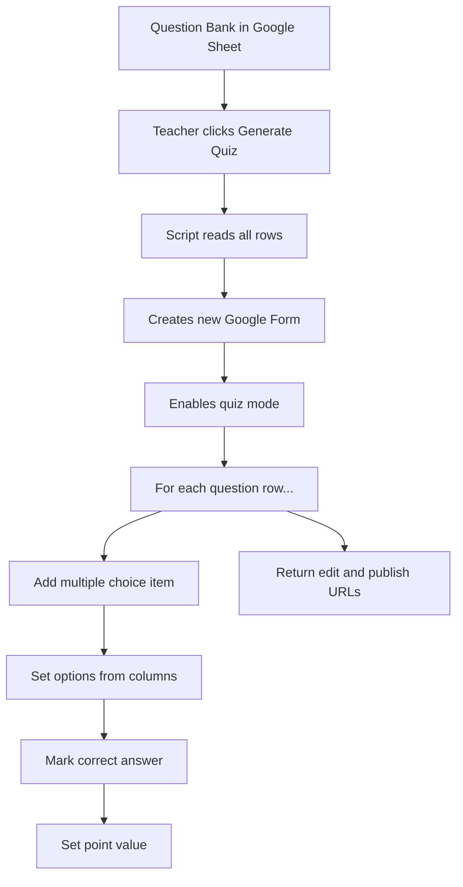

# Create Google Form Quizzes from a Sheet

Creating quizzes in Google Forms is click-heavy. Each question requires typing the prompt, adding options, marking the correct answer, and setting point values. For a 20-question quiz, that is easily 30 minutes of clicking.

In this lab, you will build a script that reads a question bank from a Google Sheet and generates a complete Google Form quiz in seconds.

## What You Will Build

An Apps Script that:

1. Reads a question bank from a Google Sheet
2. Creates a new Google Form with quiz mode enabled
3. Adds multiple-choice questions with options
4. Sets correct answers and point values
5. Returns the Form URL to the teacher

## Setup: The Question Bank

Create a sheet called **"Question Bank"** with these columns:

| Topic | Question | Type | Option A | Option B | Option C | Option D | Correct | Points | Difficulty |
|-------|----------|------|----------|----------|----------|----------|---------|--------|------------|
| DNS | What does DNS stand for? | MC | Domain Name System | Digital Network Service | Data Name Server | Domain Net Service | A | 2 | Easy |
| DNS | What DNS record type points a domain to an IP address? | MC | A | CNAME | MX | TXT | A | 2 | Medium |
| Domains | What is the typical annual cost of a .com domain? | MC | $10-15 | $100-150 | $1-2 | $500+ | A | 1 | Easy |
| Apps Script | Where do container-bound scripts live? | MC | Inside a Google Workspace file | On your local computer | In a Chrome extension | On GitHub | A | 2 | Easy |

## The Script

```javascript
function onOpen() {
  SpreadsheetApp.getUi()
    .createMenu('Teacher Tools')
    .addItem('Generate Quiz from Question Bank', 'generateQuiz')
    .addToUi();
}

function generateQuiz() {
  const ui = SpreadsheetApp.getUi();
  
  // Ask for quiz title
  const response = ui.prompt(
    'Generate Quiz',
    'Enter a title for the quiz:',
    ui.ButtonSet.OK_CANCEL
  );
  
  if (response.getSelectedButton() !== ui.Button.OK) return;
  const quizTitle = response.getResponseText() || 'Generated Quiz';
  
  const sheet = SpreadsheetApp.getActiveSheet();
  const data = sheet.getDataRange().getValues();
  const headers = data[0];
  
  // Find columns
  const cols = {
    question: headers.indexOf('Question'),
    optA: headers.indexOf('Option A'),
    optB: headers.indexOf('Option B'),
    optC: headers.indexOf('Option C'),
    optD: headers.indexOf('Option D'),
    correct: headers.indexOf('Correct'),
    points: headers.indexOf('Points'),
    topic: headers.indexOf('Topic'),
  };
  
  // Create the form
  const form = FormApp.create(quizTitle);
  form.setIsQuiz(true);
  form.setDescription(
    'Generated from the OpenTeachStack question bank.\n' +
    'Date: ' + new Date().toLocaleDateString()
  );
  
  let totalPoints = 0;
  
  // Add questions
  for (let i = 1; i < data.length; i++) {
    const row = data[i];
    if (!row[cols.question]) continue;
    
    const questionText = row[cols.question];
    const options = [
      row[cols.optA],
      row[cols.optB],
      row[cols.optC],
      row[cols.optD],
    ].filter(opt => opt !== '' && opt !== undefined);
    
    const correctLetter = String(row[cols.correct]).toUpperCase();
    const correctIndex = correctLetter.charCodeAt(0) - 65; // A=0, B=1, etc.
    const points = row[cols.points] || 1;
    
    // Create multiple choice question
    const item = form.addMultipleChoiceItem();
    item.setTitle(questionText);
    item.setPoints(points);
    
    // Build choices
    const choices = options.map((opt, idx) => {
      if (idx === correctIndex) {
        return item.createChoice(opt, true);
      }
      return item.createChoice(opt, false);
    });
    
    item.setChoices(choices);
    item.setRequired(true);
    
    totalPoints += points;
    
    SpreadsheetApp.getActiveSpreadsheet().toast(
      `Added: ${questionText.substring(0, 50)}...`, 'Progress', 1
    );
  }
  
  // Show result
  const formUrl = form.getEditUrl();
  const publishUrl = form.getPublishedUrl();
  
  ui.alert(
    'Quiz Generated!',
    `Title: ${quizTitle}\n` +
    `Questions: ${data.length - 1}\n` +
    `Total Points: ${totalPoints}\n\n` +
    `Edit URL:\n${formUrl}\n\n` +
    `Student URL:\n${publishUrl}`,
    ui.ButtonSet.OK
  );
}
```

## How It Works



Key API calls:

- **`FormApp.create(title)`** — Creates a new Google Form
- **`form.setIsQuiz(true)`** — Enables quiz mode with grading
- **`form.addMultipleChoiceItem()`** — Adds a multiple-choice question
- **`item.createChoice(text, isCorrect)`** — Creates an answer choice
- **`item.setPoints(n)`** — Sets the point value for auto-grading

<RealityCheck>
This script creates real Google Forms in your account. Each run creates a new form — it does not update existing ones. If you run it five times, you get five forms. Name them carefully and delete test forms when done.
</RealityCheck>

## Extending the Script

Ideas for next steps:

- **Filter by topic:** Add a prompt that asks which topic to include, then filter rows
- **Randomize order:** Shuffle the questions before adding them to the form
- **Add sections:** Group questions by topic using form sections
- **True/False support:** Check the Type column and use `addCheckboxItem()` for T/F
- **Short answer:** Use `addTextItem()` for open-ended questions

<TeacherNote>
The question bank pattern is extremely powerful. Once teachers have a well-structured question bank, they can generate quizzes for any unit in seconds. Encourage building the bank incrementally — add 5 questions after each lesson.
</TeacherNote>

<BuildTask>
Complete this lab:

1. Create a Question Bank sheet with at least 10 questions across 2-3 topics
2. Add the quiz generator script
3. Generate a quiz and test it by filling it out
4. Verify that the auto-grading works correctly
5. Generate a second quiz with different questions to confirm reusability

Estimated time: 60 minutes
</BuildTask>

