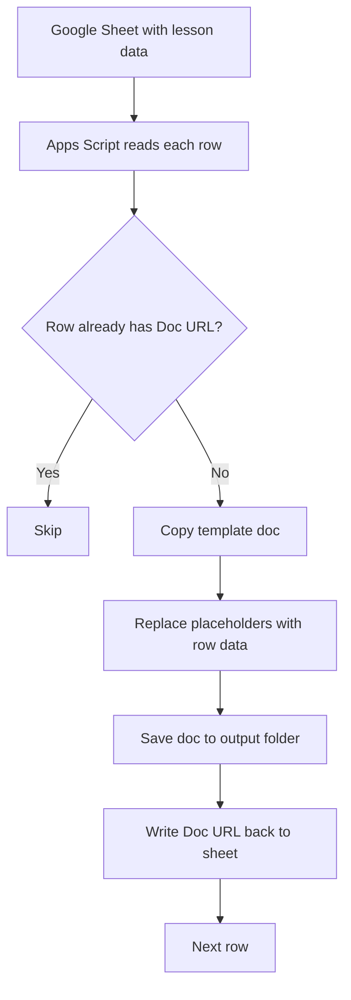

# Generate Docs from Sheet Rows

Mail merge is one of the most requested features in education. You have a template — a lesson plan, a letter, a report — and you need to fill it with data from a spreadsheet to create individual documents.

Google Docs does not have built-in mail merge. But Apps Script makes it straightforward.

## What You Will Build

An Apps Script that:

1. Reads rows from a Google Sheet (lesson titles, descriptions, outcomes)
2. Copies a Google Doc template for each row
3. Replaces placeholder text in the copy with data from the row
4. Saves each generated document to a designated folder
5. Writes the document URL back to the spreadsheet

## Setup: The Template

Create a Google Doc template with placeholders using double curly braces:

```
Lesson Plan: {{LESSON_TITLE}}

Module: {{MODULE_NAME}}
Duration: {{DURATION}}
Level: {{LEVEL}}

Summary
{{SUMMARY}}

Learning Outcomes
{{OUTCOMES}}

Notes
[Add your notes here]
```

Copy the template's file ID from the URL. The ID is the long string between `/d/` and `/edit`:
```
https://docs.google.com/document/d/THIS_IS_THE_ID/edit
```

## Setup: The Sheet

Create a Google Sheet with these columns:

| Lesson Title | Module | Duration | Level | Summary | Outcomes | Doc URL |
|-------------|--------|----------|-------|---------|----------|---------|
| What Is a Domain? | Digital Home | 45 min | Beginner | A domain is the human-readable address... | Explain what a domain is; Distinguish domain, DNS, hosting | |
| DNS Explained | Digital Home | 40 min | Beginner | DNS is the phonebook of the internet... | Explain what DNS does; Identify common record types | |

## The Script

```javascript
function onOpen() {
  SpreadsheetApp.getUi()
    .createMenu('Teacher Tools')
    .addItem('Generate Lesson Docs', 'generateDocs')
    .addToUi();
}

function generateDocs() {
  const ui = SpreadsheetApp.getUi();
  
  // Configuration — update these values
  const TEMPLATE_ID = 'YOUR_TEMPLATE_DOC_ID_HERE';
  const OUTPUT_FOLDER_ID = 'YOUR_OUTPUT_FOLDER_ID_HERE';
  
  const sheet = SpreadsheetApp.getActiveSheet();
  const data = sheet.getDataRange().getValues();
  const headers = data[0];
  
  // Find column indices
  const cols = {
    title: headers.indexOf('Lesson Title'),
    module: headers.indexOf('Module'),
    duration: headers.indexOf('Duration'),
    level: headers.indexOf('Level'),
    summary: headers.indexOf('Summary'),
    outcomes: headers.indexOf('Outcomes'),
    url: headers.indexOf('Doc URL'),
  };
  
  const template = DriveApp.getFileById(TEMPLATE_ID);
  const outputFolder = DriveApp.getFolderById(OUTPUT_FOLDER_ID);
  
  let created = 0;
  
  for (let i = 1; i < data.length; i++) {
    const row = data[i];
    const title = row[cols.title];
    
    if (!title) continue;
    
    // Skip rows that already have a Doc URL
    if (row[cols.url]) {
      SpreadsheetApp.getActiveSpreadsheet().toast(
        `Skipping: ${title} (already generated)`, 'Info', 2
      );
      continue;
    }
    
    // Copy the template
    const docName = `Lesson Plan - ${title}`;
    const copy = template.makeCopy(docName, outputFolder);
    const doc = DocumentApp.openById(copy.getId());
    const body = doc.getBody();
    
    // Replace placeholders
    body.replaceText('\\{\\{LESSON_TITLE\\}\\}', title);
    body.replaceText('\\{\\{MODULE_NAME\\}\\}', row[cols.module] || '');
    body.replaceText('\\{\\{DURATION\\}\\}', row[cols.duration] || '');
    body.replaceText('\\{\\{LEVEL\\}\\}', row[cols.level] || '');
    body.replaceText('\\{\\{SUMMARY\\}\\}', row[cols.summary] || '');
    
    // Format outcomes as a bulleted list
    const outcomes = String(row[cols.outcomes] || '')
      .split(';')
      .map(o => o.trim())
      .filter(o => o)
      .join('\n• ');
    body.replaceText('\\{\\{OUTCOMES\\}\\}', outcomes ? '• ' + outcomes : '');
    
    // Save and close
    doc.saveAndClose();
    
    // Write URL back to sheet
    if (cols.url !== -1) {
      sheet.getRange(i + 1, cols.url + 1).setValue(doc.getUrl());
    }
    
    created++;
    SpreadsheetApp.getActiveSpreadsheet().toast(
      `Created: ${docName}`, 'Progress', 2
    );
  }
  
  ui.alert(
    'Done!',
    `Generated ${created} lesson plan document(s).\n\n` +
    `Output folder: ${outputFolder.getUrl()}`,
    ui.ButtonSet.OK
  );
}
```

## How It Works



Key patterns:

- **`template.makeCopy(name, folder)`** — Creates a copy of the template in the specified folder
- **`body.replaceText(pattern, replacement)`** — Finds and replaces text using regex patterns
- **`\\{\\{...\\}\\}`** — The double curly braces need to be escaped in regex
- **Skip logic** — Checking for existing URLs prevents creating duplicates on re-runs

<RealityCheck>
The `replaceText` method uses regex, so special characters in your data (like `$`, `\`, or `{`) can cause unexpected results. For teacher-scale data, this rarely matters, but be aware if you see strange output in generated documents.
</RealityCheck>

## Customization Ideas

- Add date stamps to generated file names
- Include the teacher's name from a settings cell
- Generate different templates for different lesson types (lecture vs. lab)
- Add formatting (bold headers, colored text) using Apps Script's text styling methods
- Create a PDF version alongside the Google Doc

<TeacherNote>
This pattern — template + data → documents — is the foundation of curriculum automation. Once teachers see their first batch of documents generated in seconds instead of hours, the value of the command center spreadsheet becomes obvious. Start with a simple template and add complexity later.
</TeacherNote>

<BuildTask>
Complete this lab:

1. Create a Google Doc template with at least 4 placeholder fields
2. Create a Sheet with 5 rows of lesson data
3. Create an output folder in Google Drive
4. Update the script with your template and folder IDs
5. Run the generator and verify the documents
6. Open one generated doc and confirm the placeholders were replaced correctly

Estimated time: 45 minutes
</BuildTask>
