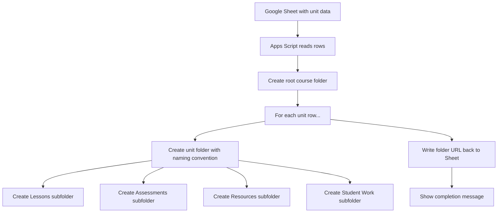

# Generate Unit Folders with Apps Script

Manually creating folder structures in Google Drive is tedious. For a course with 10 units, each needing four subfolders, that is 50 folders to create by hand.

In this lab, you will build a script that reads unit information from a Google Sheet and automatically creates the entire folder structure in Drive.

## What You Will Build

An Apps Script that:

1. Reads a list of units from a Google Sheet
2. Creates a root course folder in Google Drive
3. Creates a subfolder for each unit
4. Creates standard subfolders (Lessons, Assessments, Resources, Student Work) inside each unit folder
5. Writes the folder URLs back to the spreadsheet

## Setup: The Sheet

Create a Google Sheet with these columns:

| Unit Number | Unit Name | Quarter | Status | Folder URL |
|-------------|-----------|---------|--------|------------|
| 01 | Foundations | Q1 | Active | |
| 02 | Digital Home | Q1 | Active | |
| 03 | Teacher App Stack | Q2 | Active | |
| 04 | Google Workspace Systems | Q2 | Active | |
| 05 | Apps Script Labs | Q3 | Active | |

The "Folder URL" column will be filled by the script.

## The Script

Open **Extensions → Apps Script** and replace the contents with:

```javascript
function onOpen() {
  SpreadsheetApp.getUi()
    .createMenu('Teacher Tools')
    .addItem('Generate Unit Folders', 'generateFolders')
    .addToUi();
}

function generateFolders() {
  const sheet = SpreadsheetApp.getActiveSheet();
  const data = sheet.getDataRange().getValues();
  const headers = data[0];
  
  // Find column indices
  const numCol = headers.indexOf('Unit Number');
  const nameCol = headers.indexOf('Unit Name');
  const quarterCol = headers.indexOf('Quarter');
  const urlCol = headers.indexOf('Folder URL');
  
  if (numCol === -1 || nameCol === -1) {
    SpreadsheetApp.getUi().alert(
      'Error', 
      'Sheet must have "Unit Number" and "Unit Name" columns.', 
      SpreadsheetApp.getUi().ButtonSet.OK
    );
    return;
  }
  
  // Create or find root course folder
  const courseName = 'OTS-101 OpenTeachStack Foundations';
  const rootFolder = getOrCreateFolder(DriveApp.getRootFolder(), courseName);
  
  // Standard subfolders for each unit
  const subfolders = ['Lessons', 'Assessments', 'Resources', 'Student Work'];
  
  // Process each row
  for (let i = 1; i < data.length; i++) {
    const unitNum = String(data[i][numCol]).padStart(2, '0');
    const unitName = data[i][nameCol];
    const quarter = data[i][quarterCol] || '';
    
    if (!unitName) continue;
    
    // Create unit folder with naming convention
    const folderName = `${quarter} - Unit ${unitNum} - ${unitName}`;
    const unitFolder = getOrCreateFolder(rootFolder, folderName);
    
    // Create subfolders
    subfolders.forEach(sub => {
      getOrCreateFolder(unitFolder, sub);
    });
    
    // Write folder URL back to sheet
    if (urlCol !== -1) {
      sheet.getRange(i + 1, urlCol + 1).setValue(unitFolder.getUrl());
    }
    
    // Log progress
    SpreadsheetApp.getActiveSpreadsheet().toast(
      `Created: ${folderName}`, 'Progress', 2
    );
  }
  
  SpreadsheetApp.getUi().alert(
    'Done!', 
    `Created ${data.length - 1} unit folders in "${courseName}".\n\n` +
    `Root folder: ${rootFolder.getUrl()}`,
    SpreadsheetApp.getUi().ButtonSet.OK
  );
}

function getOrCreateFolder(parent, name) {
  const folders = parent.getFoldersByName(name);
  if (folders.hasNext()) {
    return folders.next();
  }
  return parent.createFolder(name);
}
```

## How It Works



Key patterns:

- **`getDataRange().getValues()`** — Reads all data from the sheet as a 2D array
- **`DriveApp.getRootFolder()`** — Gets the top level of your Google Drive
- **`parent.createFolder(name)`** — Creates a folder inside another folder
- **`getOrCreateFolder()`** — A helper that avoids creating duplicates

## Running the Script

1. Click **Teacher Tools → Generate Unit Folders**
2. Authorize when prompted
3. Watch the toast notifications as folders are created
4. Check your Google Drive — the full folder structure is there
5. Check the sheet — Folder URL column is now filled

<RealityCheck>
This script creates real folders in your Google Drive. Run it on a test sheet first. The `getOrCreateFolder` helper prevents duplicates if you run it twice, but you should still verify the results before using it with real curriculum data.
</RealityCheck>

## Customization Ideas

- Change the subfolder names to match your workflow
- Add a "Templates" subfolder that copies template files from a source folder
- Add a column for "Year" and organize by academic year
- Add color coding to folders using `folder.setColor()`

<TeacherNote>
This pattern — reading from a spreadsheet and creating Google Workspace artifacts — is the core of all five Apps Script labs. Once students understand this loop (read sheet → process rows → create things → report back), they can adapt it for any automation.
</TeacherNote>

<BuildTask>
Complete this lab:

1. Create the setup spreadsheet with at least 5 units
2. Add the script code
3. Run the generator and verify the folder structure in Drive
4. Modify the subfolder names to match your actual workflow
5. Add one additional subfolder of your choice

Estimated time: 45 minutes
</BuildTask>

