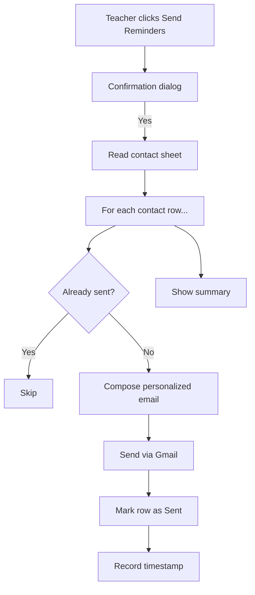

# Send Reminder Emails from Sheet Data

Sending individual emails to students or parents is time-consuming. Sending the same email to everyone feels impersonal. Apps Script lets you do both: send personalized emails to everyone on a list, in seconds.

## What You Will Build

An Apps Script that:

1. Reads contact information from a Google Sheet
2. Composes personalized emails using a template
3. Sends emails via Gmail
4. Marks each row as "Sent" to prevent duplicates
5. Logs the send time

## Setup: The Contact Sheet

Create a Google Sheet called **"Contacts"** with these columns:

| Name | Email | Group | Subject | Status | Sent Date |
|------|-------|-------|---------|--------|-----------|
| Alex Johnson | alex@example.com | Period 1 | Missing: Unit 2 Quiz | | |
| Maria Garcia | maria@example.com | Period 3 | Reminder: Project Due Friday | | |
| Sam Lee | sam@example.com | Period 1 | Great work on the presentation | | |

## The Script

```javascript
function onOpen() {
  SpreadsheetApp.getUi()
    .createMenu('Teacher Tools')
    .addItem('Send Reminder Emails', 'sendReminders')
    .addItem('Preview Emails (No Send)', 'previewEmails')
    .addToUi();
}

function sendReminders() {
  const ui = SpreadsheetApp.getUi();
  
  // Confirmation dialog
  const confirm = ui.alert(
    'Send Emails',
    'This will send real emails to all contacts without a "Sent" status. Continue?',
    ui.ButtonSet.YES_NO
  );
  
  if (confirm !== ui.Button.YES) return;
  
  const results = processEmails(true);
  
  ui.alert(
    'Emails Sent',
    `Sent: ${results.sent}\nSkipped (already sent): ${results.skipped}\nErrors: ${results.errors}`,
    ui.ButtonSet.OK
  );
}

function previewEmails() {
  const results = processEmails(false);
  
  let preview = `Preview of ${results.previews.length} email(s):\n\n`;
  results.previews.forEach((p, i) => {
    preview += `--- Email ${i + 1} ---\n`;
    preview += `To: ${p.to}\n`;
    preview += `Subject: ${p.subject}\n`;
    preview += `Body: ${p.body.substring(0, 200)}...\n\n`;
  });
  
  SpreadsheetApp.getUi().alert('Email Preview', preview, SpreadsheetApp.getUi().ButtonSet.OK);
}

function processEmails(actualSend) {
  const sheet = SpreadsheetApp.getActiveSheet();
  const data = sheet.getDataRange().getValues();
  const headers = data[0];
  
  const cols = {
    name: headers.indexOf('Name'),
    email: headers.indexOf('Email'),
    group: headers.indexOf('Group'),
    subject: headers.indexOf('Subject'),
    status: headers.indexOf('Status'),
    sentDate: headers.indexOf('Sent Date'),
  };
  
  const results = { sent: 0, skipped: 0, errors: 0, previews: [] };
  
  for (let i = 1; i < data.length; i++) {
    const row = data[i];
    const name = row[cols.name];
    const email = row[cols.email];
    const subject = row[cols.subject];
    const status = row[cols.status];
    
    if (!name || !email || !subject) continue;
    
    // Skip already-sent rows
    if (status === 'Sent') {
      results.skipped++;
      continue;
    }
    
    // Compose the email body
    const body = composeEmail(name, subject, row[cols.group]);
    
    if (actualSend) {
      try {
        GmailApp.sendEmail(email, subject, body, {
          name: 'Your Teacher Name',
          htmlBody: composeHtmlEmail(name, subject, row[cols.group]),
        });
        
        // Mark as sent
        sheet.getRange(i + 1, cols.status + 1).setValue('Sent');
        sheet.getRange(i + 1, cols.sentDate + 1).setValue(new Date());
        results.sent++;
        
      } catch (error) {
        sheet.getRange(i + 1, cols.status + 1).setValue('Error: ' + error.message);
        results.errors++;
      }
    } else {
      results.previews.push({ to: email, subject: subject, body: body });
    }
  }
  
  return results;
}

function composeEmail(name, subject, group) {
  return `Hi ${name},\n\n` +
    `${subject}\n\n` +
    `If you have any questions, please let me know.\n\n` +
    `Best,\nYour Teacher Name`;
}

function composeHtmlEmail(name, subject, group) {
  return `
    <div style="font-family: Arial, sans-serif; max-width: 600px;">
      <p>Hi ${name},</p>
      <p>${subject}</p>
      <p>If you have any questions, please let me know.</p>
      <p>Best,<br>Your Teacher Name</p>
      <hr style="border: none; border-top: 1px solid #ddd; margin-top: 20px;">
      <p style="font-size: 12px; color: #666;">
        This email was sent from my course management system.
      </p>
    </div>
  `;
}
```

## How It Works



Key safeguards:

- **Confirmation dialog** — Prevents accidental sends
- **Preview mode** — See emails before sending
- **Status tracking** — Rows marked "Sent" are skipped on re-run
- **Error handling** — Failed sends are logged, not silently lost
- **Timestamp** — Know exactly when each email was sent

<RealityCheck>
Gmail has daily sending limits. Free Google accounts can send ~100 emails/day via Apps Script. Google Workspace accounts can send ~1,500/day. For a single class, this is more than enough. For school-wide communications, use a proper email marketing tool.

Also: always use the Preview function first. Sending test emails to yourself is not optional — it is mandatory.
</RealityCheck>

## Important: Email Etiquette

This script sends real emails from your real Gmail account. Guidelines:

1. **Always preview first** — Use the preview function before sending
2. **Send a test to yourself** — Add your own email to the sheet and send one email first
3. **Check your Subject column** — Typos in subjects are embarrassing and permanent
4. **Respect frequency** — Do not send daily automated emails. Weekly at most.
5. **Include opt-out info** — For parent communications, follow your school's communication policies

<TeacherNote>
Email automation is the most sensitive Apps Script lab in this course. Emphasize the preview function and the importance of testing. One accidental mass email with a typo teaches a lesson no lecture can match — but it is better to prevent it than to learn from it.
</TeacherNote>

<BuildTask>
Complete this lab:

1. Create the Contacts sheet with 3-5 test rows (use your own email for testing)
2. Add the script code
3. Use the Preview function to see what would be sent
4. Send a test email to yourself
5. Verify the Status and Sent Date columns update correctly
6. Customize the email template to match your voice

Estimated time: 30 minutes
</BuildTask>
