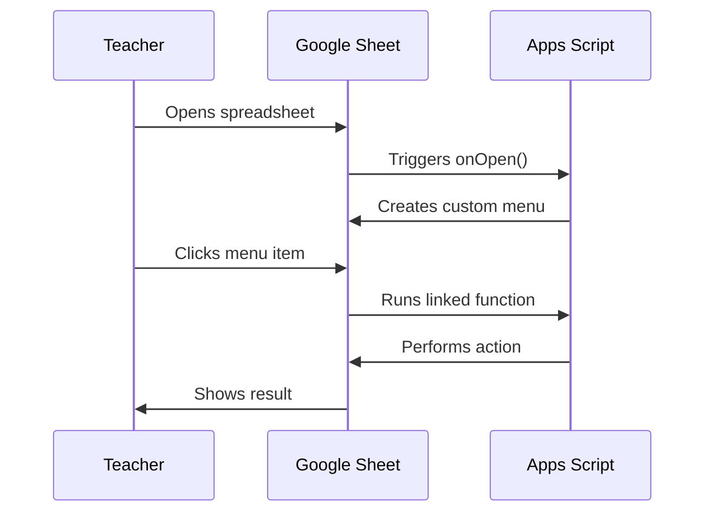

# Your First Apps Script Custom Menu

In this lab, you will add a custom menu to a Google Sheet. When you click a menu item, it runs a function you wrote.

This is the most important pattern in Apps Script for teachers: a custom menu that triggers your automation.

## What You Will Build

A Google Sheet with a custom menu called **"Teacher Tools"** that contains three items:

1. **Say Hello** — Shows a pop-up alert
2. **Show Sheet Info** — Displays the sheet name and row count
3. **Mark Today's Date** — Writes today's date to the active cell

## Step 1: Open the Script Editor

1. Create a new Google Sheet (or open an existing one)
2. Click **Extensions → Apps Script**
3. Delete the default empty function

## Step 2: Write the onOpen Function

The `onOpen()` function runs automatically every time someone opens the spreadsheet. This is where you add your custom menu.

Replace the default code with:

```javascript
function onOpen() {
  const ui = SpreadsheetApp.getUi();
  ui.createMenu('Teacher Tools')
    .addItem('Say Hello', 'sayHello')
    .addItem('Show Sheet Info', 'showSheetInfo')
    .addSeparator()
    .addItem('Mark Today\'s Date', 'markToday')
    .addToUi();
}
```

This creates a menu called "Teacher Tools" in the spreadsheet menu bar with three items.

## Step 3: Write the Menu Functions

Add these functions below `onOpen()`:

```javascript
function sayHello() {
  const ui = SpreadsheetApp.getUi();
  ui.alert('Hello, Teacher!', 
    'Your custom menu is working. You can now automate anything in this sheet.', 
    ui.ButtonSet.OK);
}

function showSheetInfo() {
  const sheet = SpreadsheetApp.getActiveSheet();
  const name = sheet.getName();
  const rows = sheet.getLastRow();
  const cols = sheet.getLastColumn();
  
  const ui = SpreadsheetApp.getUi();
  ui.alert('Sheet Info', 
    `Sheet: ${name}\nRows with data: ${rows}\nColumns with data: ${cols}`, 
    ui.ButtonSet.OK);
}

function markToday() {
  const cell = SpreadsheetApp.getActiveSheet().getActiveCell();
  cell.setValue(new Date());
  cell.setNumberFormat('yyyy-MM-dd');
  
  SpreadsheetApp.getActiveSpreadsheet().toast(
    'Date written to ' + cell.getA1Notation(), 
    'Done', 3);
}
```

## Step 4: Run and Authorize

1. Click the **Run** button (▶) with `onOpen` selected
2. Google will ask you to authorize the script — click through the permissions
3. Close the spreadsheet tab and reopen it
4. You should see **"Teacher Tools"** in the menu bar

<RealityCheck>
The first time you run an Apps Script, Google shows a scary-looking authorization dialog. This is normal. You are authorizing your own script to access your own spreadsheet. For scripts you write yourself, this is safe.
</RealityCheck>

## How It Works



Key concepts:

- **`onOpen()`** is a special function name. Google Sheets calls it automatically when the sheet opens.
- **`SpreadsheetApp.getUi()`** gives you access to the user interface.
- **`createMenu()`** builds a menu. Each `.addItem(label, functionName)` links a menu item to a function.
- **`toast()`** shows a small notification at the bottom of the sheet.

## Challenge: Extend the Menu

Once your basic menu works, try adding:

```javascript
function clearCurrentCell() {
  const cell = SpreadsheetApp.getActiveSheet().getActiveCell();
  cell.clear();
  SpreadsheetApp.getActiveSpreadsheet().toast(
    'Cleared ' + cell.getA1Notation(), 'Done', 3);
}
```

Then add it to your menu in `onOpen()`:

```javascript
.addItem('Clear Current Cell', 'clearCurrentCell')
```

<TeacherNote>
Custom menus are the entry point for every advanced automation in this course. Folder generators, document creators, quiz builders — they all start with a menu item that a teacher clicks. Master this pattern first.
</TeacherNote>

<BuildTask>
Complete this lab:

1. Create a Google Sheet
2. Add the onOpen function with the Teacher Tools menu
3. Add all three functions (sayHello, showSheetInfo, markToday)
4. Authorize and test each menu item
5. Add one custom menu item of your own

Estimated time: 30 minutes
</BuildTask>
