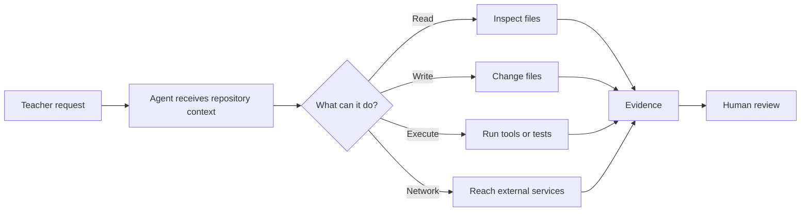

Most teachers first meet AI in a box.

You type something. It types something back.

That mental model stops being good enough the moment the AI enters a terminal.

A command-line agent can work inside a project. Depending on the tool and the permissions you grant, it may inspect files, edit them, run commands, read Git state, or connect to outside tools. The important shift is not that the AI suddenly became smarter. The shift is that **its answer can now become an action**.

That changes your job too.

You are no longer reviewing only words on a screen. You are reviewing what had access, what changed, what ran, and what evidence proves the result.



## The four verbs that matter

For this course, start with four verbs:

| Action | Plain-language meaning | Question to ask |
| --- | --- | --- |
| **Read** | Inspect project information | What can the agent see? |
| **Write** | Change project information | What can the agent modify? |
| **Execute** | Run a command or tool | What can the agent make the computer do? |
| **Network** | Reach something outside the local project | What data or service can it contact? |

Different products expose these controls differently. That provider-specific behavior comes later.

Right now, learn the stable idea underneath them: **access creates an action surface**.

The larger the action surface, the more evidence and review you need.

<TakeawayStrip tone="teacher">
  Do not begin by asking, "What did the agent say?" Begin by asking, "What could it touch, and what proves what happened?"
</TakeawayStrip>

## Chat workflow vs agent workflow

A normal chat interaction might look like this:

```text
Teacher: Write a small script that renames these files.
AI: Here is a script you can copy.
```

You still decide whether the script ever touches your machine.

An agent workflow can look more like this:

```text
Teacher: Inspect this project and tell me why the lesson index is wrong.
Agent: reads files -> inspects config -> checks Git state -> reports findings
```

Or, with broader permission:

```text
Teacher: Fix the lesson index and verify the change.
Agent: reads files -> writes files -> runs a check -> produces a diff
```

That second workflow is useful because the agent can work with the real project instead of guessing from a pasted fragment.

It is also higher stakes because the project is no longer hypothetical.

## Control is not the same as fear

The goal of this course is not to make you scared of coding agents.

It is to make them boring enough to control.

You should be able to look at a session and answer:

1. What repository or working directory was in scope?
2. What instructions shaped the work?
3. What permissions were available?
4. What files were read or changed?
5. What commands were executed?
6. What did Git show before and after?
7. What evidence supports the claim that the task worked?
8. What is the rollback path if the result is wrong?

If those questions feel normal, the terminal stops being magic. It becomes an inspectable work environment.

## What counts as evidence?

An agent saying this is **not enough**:

```text
Done. I fixed the issue and everything looks good.
```

Useful evidence looks more like:

```text
[READ] src/data/courses.ts
[WRITE] src/data/courses.ts
[GIT] 1 file changed
[EXEC] npm test
[RESULT] 12 checks passed
```

Even then, you still inspect the file and the diff. A test proves something specific passed. It does not prove the agent made the right instructional decision.

This distinction matters in teacher-built software because technical correctness and instructional correctness are not the same thing.

A button can work perfectly and still give students terrible directions.

## Your first operating rule

Throughout OTS-320, use this sequence:

```text
inspect -> understand -> bound the task -> change -> diff -> verify -> review -> keep or revert
```

Not:

```text
prompt -> trust -> hope
```

You will use Codex CLI, Claude Code, and Antigravity CLI as concrete environments for practicing that sequence. The products will change over time. The evidence habit should survive them.

## Build: your agent action map

Create a four-row note for a tool you already use or plan to use.

```text
READ
What information could the tool inspect?

WRITE
What could it change?

EXECUTE
What commands or tools could it run?

NETWORK
What outside services or data could it reach?
```

Do not worry yet about knowing every product setting. This is a mental-model check.

The point is to stop thinking about an AI agent as one giant permission called "AI access."

## Quality check

Your map is useful if someone else can look at it and tell the difference between:

- reading a repository and changing it,
- changing a file and running that file,
- running a local tool and contacting an outside service.

Those boundaries become important very quickly.

## Source and version note

Provider commands and permission labels are version-sensitive. Later chapters use the OTS-320 evidence library to tie specific Codex, Claude Code, and Antigravity behavior to current first-party documentation. This chapter deliberately starts with the stable concepts before product syntax.

## Reflection

What is one AI task you would happily allow in **read-only** mode but would not yet allow to write or execute?

Keep that example. We will use it when we build permission boundaries in Chapter 2.