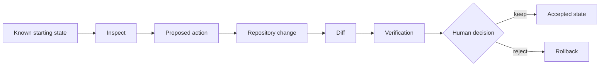

A chatbot can be wrong and waste your time.

A repository agent can be wrong and change the project while doing it.

That is the practical difference this course cares about.

The useful part of a coding agent is that it can stop pretending the project is only the three files you pasted into a chat window. It can inspect the actual repository, follow imports, read configuration, check scripts, and work against the real structure.

The danger is the same feature.

If you give the agent a vague goal and broad access, it can make a technically reasonable decision you never intended.

## A teacher problem

Imagine you have a small course site. One lesson card is showing the wrong title.

A chat-style request might be:

```text
Why is my lesson title wrong?
```

The model has almost no context. You will probably paste code, explain folder names, and keep answering follow-up questions.

A weak agent request might be:

```text
Fix the lesson title.
```

Now the tool may have context, but **you have not defined the boundary**.

What lesson?

What file owns the title?

Should the agent change content, metadata, a component, or routing code?

Can it rename files?

Can it run a formatter across the whole repo?

Can it change other titles for consistency?

Humans fill in those blanks automatically. Agents fill them in too. The problem is that their assumptions can become repository changes.

## Better: separate investigation from modification

Start with investigation.

```text
Inspect the repository and find the source of the incorrect lesson title.
Do not modify files.
Report:
1. the file that owns the title,
2. any other files that transform or display it,
3. the smallest likely fix,
4. what you would verify after the change.
```

That task is useful even before the agent writes anything.

You get a map of the problem first.

Then you can decide whether the proposed change makes sense.

Only after that would you move to something like:

```text
Change only the source field that owns this lesson title.
Do not rename files or modify unrelated lesson content.
After the edit, show the diff and run the targeted content check.
Stop if the title is generated from more than one source.
```

The second prompt is not "better" because it is longer.

It is better because the work is **bounded and reviewable**.

## Think in state changes

A repository starts in one state.

The agent may move it to another.



Your job is to make each transition visible enough to review.

That means you need more than the final answer.

## The agent response is a claim

Suppose the agent says:

```text
I found the issue in course.json, corrected the title, and verified the course.
```

Break that sentence into claims:

| Claim | Better evidence |
| --- | --- |
| The source was `course.json` | file read / source trace |
| The title was corrected | diff |
| Nothing unrelated changed | diff + Git status |
| The course still works | targeted check, typecheck, test, or manual review |
| The instructional title is correct | human content review |

This is a major habit for the rest of the course:

**Turn agent sentences into things you can inspect.**

<RealityCheck title="A green check is not the whole review">
  A build or test can prove that a technical condition passed. It cannot decide whether a lesson title is accurate, whether a rubric is fair, whether student directions make sense, or whether the agent changed the instructional meaning you intended.
</RealityCheck>

## Small scope makes review possible

Teachers often reach for agents because they are short on time.

That makes giant prompts tempting:

```text
Clean up this whole course, fix the design, improve accessibility,
rewrite weak lessons, update the docs, and make sure everything works.
```

That request sounds efficient.

It is terrible to review.

A single diff might contain layout changes, copy edits, deleted content, dependency changes, route changes, and "helpful" refactors. Even if the result looks polished, you have created a review problem.

A better sequence is smaller:

```text
1. inspect the course navigation
2. identify one source-of-truth problem
3. fix that problem
4. review the diff
5. verify the affected route
6. keep or revert
```

Then take the next problem.

Speed comes from reducing rework, not from letting an agent touch everything at once.

## Build: convert a chat request into a repository task

Choose a teacher-tool problem such as:

- a broken lesson link,
- a mislabeled course card,
- a repeated assignment title,
- a small spreadsheet-export bug,
- a missing accessibility label,
- a README that no longer matches the project.

Write the task twice.

First, the chat-style version:

```text
Help me fix ____________________.
```

Then rewrite it as a repository task:

```text
Goal:

Inspect first:

Files or areas allowed:

Files or areas protected:

Expected change:

Verification:

Stop condition:
```

The **stop condition** matters.

Example:

```text
Stop if the title is generated from more than one source or if fixing it requires a route rename.
```

That tells the agent when the task has become bigger than the permission you intended to grant.

## Quality check

Your repository task is ready when another human can answer all four questions:

1. What problem is being investigated?
2. What may the agent touch?
3. What proves the requested work happened?
4. When should the agent stop and ask instead of improvising?

If those answers are missing, the task still depends too heavily on agent judgment.

## Reflection

Where do you personally tend to be vague when asking AI for technical help: the goal, the allowed scope, the verification step, or the stop condition?

That weak spot is worth knowing. Coding agents amplify it.