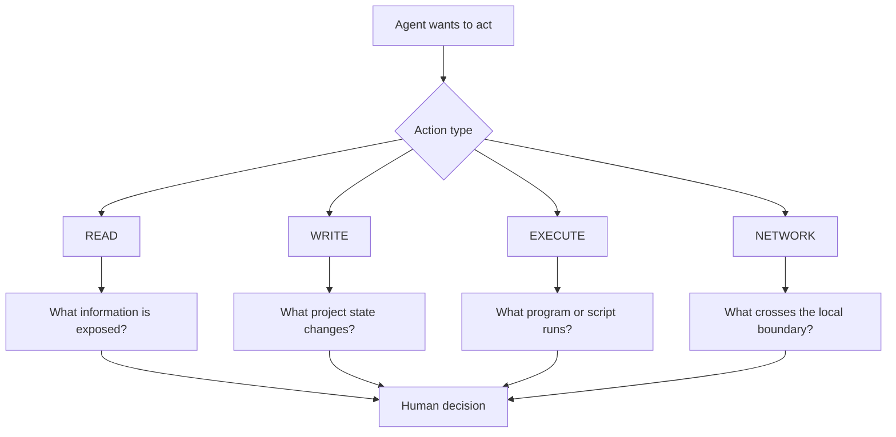

Permissions are easy to treat like pop-ups between you and the thing you actually want to do.

That is the wrong mental model for an AI agent.

A permission prompt is a decision about **what kind of action the agent is allowed to take next**.

If you understand the action, the prompt becomes useful information instead of friction.

For this course, reduce the problem to four categories:

```text
READ
WRITE
EXECUTE
NETWORK
```

Those four words will not match every product interface exactly. They are a reasoning tool you can carry between products.

## READ: what can the agent inspect?

Read access sounds harmless because it does not change a file.

But read access still matters.

A repository may contain:

- source code,
- unpublished curriculum,
- internal notes,
- answer keys,
- configuration,
- local logs,
- filenames that reveal project structure,
- environment or credential files that should never be exposed casually.

For a synthetic training repo, broad read access may be fine.

For a teacher project, ask whether the directory contains information the agent needs for the task.

For a school system or folder containing student information, the answer may be very different.

A useful question is:

> **Does this task require the agent to see this information at all?**

If not, keep it out of scope.

## WRITE: what can the agent change?

Write access turns analysis into state change.

That might mean changing one Markdown line.

It might mean modifying a TypeScript component.

It might also mean deleting, renaming, moving, reformatting, or rewriting files if the environment permits those operations.

The safest write permission is not "the agent can write."

It is closer to:

```text
The agent may modify this project for this task,
within these files or directories,
while these other areas remain protected,
and every change must be reviewable in the diff.
```

Git helps because a changed working tree is visible.

Git does not magically make a bad change safe. It gives you evidence and a rollback path.

## EXECUTE: what can the agent make the computer do?

Execution is different from editing text.

An executed command can:

- run tests,
- install packages,
- build the project,
- generate files,
- invoke a script,
- delete or move data,
- start a development server,
- call another local program.

Compare these two actions:

```text
READ package.json
```

and:

```text
EXEC npm test
```

The first inspects a file.

The second asks the machine to run whatever the `test` script represents in that project.

That may be exactly what you want. But you should understand the difference.

<RealityCheck title="A familiar command can still be project-specific">
  `npm test` looks ordinary, but its actual behavior comes from the project configuration. Read the relevant script before treating the command as harmless just because you recognize its name.
</RealityCheck>

## NETWORK: what can leave or enter the local boundary?

Network access expands the session beyond the repository.

It may be needed to:

- read current documentation,
- install dependencies,
- call an API,
- connect to an MCP server,
- query a remote service,
- send or retrieve project data.

This is where privacy, credentials, account permissions, and external service behavior start to matter.

A local file read and a request to an outside API are not the same risk.

Neither is automatically good or bad.

The point is to know which one is happening.



## Approval is a decision point

Suppose an agent asks to run a command.

Do not train yourself to click **Allow** because the session keeps stopping.

Ask:

1. What exact action is being requested?
2. Is it needed for the task I gave?
3. What scope does the approval cover?
4. What could the action change or expose?
5. What evidence will I inspect afterward?

Sometimes the right answer is yes.

Sometimes the right answer is no.

Sometimes the right answer is: **show me why you need that first**.

That is not fighting the agent. That is operating it.

## Least access is practical, not ceremonial

"Least privilege" can sound like cybersecurity policy language.

In practice it is simple:

> Give the task the smallest access that still lets the work happen.

If the job is inspection, start read-only.

If the job requires one source change, do not automatically grant broad network access.

If a command is needed, understand the command before approving it.

If the task unexpectedly expands, stop and redefine the task.

This makes mistakes smaller and reviews easier.

## Quick classification practice

For each event, identify the primary action category.

```text
1. Open README.md
2. Change src/app/page.tsx
3. Run npm test
4. Download package metadata from an external registry
5. Inspect git diff
6. Send a request to an external classroom API
```

A reasonable classification is:

| Event | Category |
| --- | --- |
| Open `README.md` | READ |
| Change `src/app/page.tsx` | WRITE |
| Run `npm test` | EXECUTE |
| Download package metadata | NETWORK + likely EXECUTE context |
| Inspect `git diff` | EXECUTE/inspection in a real shell; modeled as Git evidence in our fixture |
| Call an external classroom API | NETWORK |

The categories can overlap. That is fine.

The goal is not to win a vocabulary quiz. The goal is to notice when a task crosses a boundary.

## Build: permission decision record

Choose one agent task and fill this out:

```text
TASK:

READ
Needed? yes / no
Why?
Scope:

WRITE
Needed? yes / no
Why?
Scope:

EXECUTE
Needed? yes / no
Why?
Expected commands:

NETWORK
Needed? yes / no
Why?
Expected destination or service:

STOP CONDITION
What new request would make me pause and review the task again?
```

## Safety boundary

Do not use real student records, private school data, production credentials, or secrets while learning these workflows.

Use fictional repositories and synthetic data until you understand exactly what your agent environment can read and transmit.

## Reflection

Which permission do you currently grant most casually: read, write, execute, or network?

What evidence would make that decision more deliberate next time?