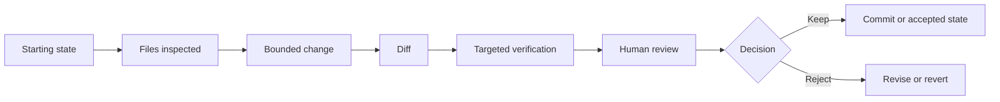

An agent can sound certain while being wrong.

That is not unique to AI. Humans do it too.

The difference is that a command-line agent can pair that confidence with repository access.

So this chapter ends with a simple standard:

> **Every important claim should point to evidence you can inspect.**

This does not mean saving thousands of lines of terminal output.

It means knowing what evidence is appropriate for the claim being made.

## Claim vs evidence

Suppose an agent reports:

```text
I fixed the broken course card, updated the correct source file,
and verified that everything still works.
```

That sentence contains several claims.

Break it apart.

| Agent claim | Evidence you would want |
| --- | --- |
| I found the correct source | file trace / inspected source |
| I changed the course card | diff |
| I changed only what was needed | Git status + diff |
| The technical check passed | command output / test result |
| The card now says the right thing | human review of rendered result or source |
| Nothing important was lost | diff + targeted manual check |

The agent summary is useful as an index.

It is not the evidence itself.

## Evidence has different jobs

There is no single magic proof that a change is good.

Different evidence answers different questions.

### Files answer: what source owns this behavior?

If a course title comes from `course.json`, reading that file can support the claim that you found the source.

But reading it does not prove the edit was correct.

### A diff answers: what changed?

A diff is one of the most important artifacts in agent-assisted work because it shows the transition from the starting state to the current state.

It helps answer:

- Which files changed?
- Which lines changed?
- Was anything deleted?
- Did the agent touch unrelated areas?
- Did the task grow beyond its original scope?

### Command output answers: what did this tool report?

A typecheck, content audit, test, formatter, or build can provide technical evidence.

Be precise about what it proves.

```text
12 tests passed
```

does not mean:

```text
The lesson is educationally strong.
```

It means the conditions represented by those 12 tests passed.

### Human review answers questions automation cannot own

Teacher-built tools have decisions that cannot be delegated to a green checkmark.

You still decide whether:

- the classroom workflow makes sense,
- the wording is accurate,
- the tool solves the intended problem,
- the result is accessible enough for the real audience,
- private information stayed out of the workflow,
- the change is worth keeping.

<TakeawayStrip tone="teacher">
  Automated evidence can tell you whether a condition passed. Human review decides whether the result belongs in your teaching system.
</TakeawayStrip>

## Build an evidence chain

Strong agent work usually creates a chain, not one proof.



If one of those links disappears, ask what you lost.

No starting state? Harder to know what changed.

No diff? Harder to review scope.

No verification? Harder to know whether the technical behavior still works.

No human review? The agent is effectively approving its own work.

No rollback path? A mistake becomes more expensive.

## Checkpoint scenario

You ask an agent to correct one broken link in a teacher resource page.

The agent reports:

```text
Fixed. I also normalized the surrounding links and cleaned up formatting.
All checks pass.
```

You inspect Git and find:

```text
3 files changed
1 requested link fixed
8 other links rewritten
2 formatting changes
```

### Decision 1

Is `All checks pass` enough reason to accept the change?

**No.**

The task expanded beyond the requested link. You need to inspect the diff and decide whether the extra work was intended.

### Decision 2

Does the extra work automatically mean the agent did something wrong?

Not necessarily.

The extra changes may be good.

The problem is that they were not part of the bounded task you agreed to review.

You can keep them after review, split them into a separate change, or revert them.

### Decision 3

What evidence matters most before making that choice?

At minimum:

- the diff,
- the original task boundary,
- the relevant verification output,
- your review of the affected page.

## The evidence ladder

Use this as a rough ladder when an agent makes a claim:

```text
WEAKEST
agent says it worked
    ↓
agent names what it changed
    ↓
files / events show what it touched
    ↓
Git diff shows the actual change
    ↓
targeted checks show technical conditions passed
    ↓
human review confirms the result matches the real goal
STRONGEST FOR A RELEASE DECISION
```

This is not a scientific scoring system.

It is a reminder to keep moving from **assertion** toward **inspection**.

## Chapter artifact: Agent Action and Evidence Map

Use the task you started earlier in this chapter.

Complete this record:

```text
TASK
What was the agent supposed to do?

CONTEXT
What repository or working directory was in scope?

READ
What did it need to inspect?
Evidence:

WRITE
What was it allowed to change?
Evidence:

EXECUTE
What was it allowed to run?
Evidence:

NETWORK
What outside access was allowed?
Evidence:

DIFF
What actually changed?

VERIFY
What targeted check supports the technical result?

HUMAN REVIEW
What still required your judgment?

ROLLBACK
How would you return to the starting state?
```

If an action category was not needed, write **not required**.

That is better than granting access automatically and leaving the evidence blank.

## Chapter check

You are ready for Chapter 2 if you can explain these statements without hand-waving:

1. A terminal agent is different from a chatbot because it can act inside a working environment.
2. Read, write, execute, and network access represent different action boundaries.
3. Permission prompts are review decisions, not just interruptions.
4. An agent summary is a claim, not proof.
5. Git diffs and targeted checks make changes easier to inspect.
6. Human review still owns instructional judgment.
7. Smaller tasks are easier to verify and roll back.

If one of those still feels fuzzy, go back to the embedded lab and deliberately trigger the read, Git, blocked execute, and blocked network events again.

## Capstone connection

Your final OTS-320 capstone will include an evidence dossier.

This chapter's action-and-evidence map is the first version of that dossier.

By the end of the course, the same idea will be attached to a real teacher-tool build: starting state, bounded prompt, agent environment, inspected files, diff, verification evidence, human review, rollback method, and documentation sources.

That is the standard.

Not "the agent said it was done."

## Reflection

Which evidence do you currently skip most often when using AI-assisted technical work: starting state, diff, verification output, human review, or rollback?

What problem does that create for you later?