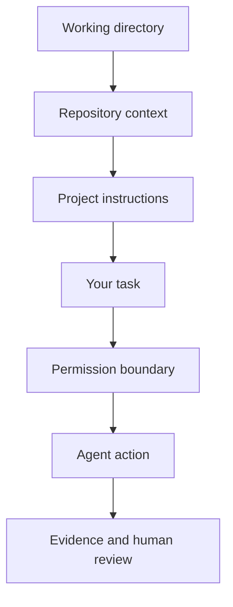

An AI coding agent does not enter a project with one clean, universal view of reality.

It starts somewhere.

That **somewhere** matters.

The working directory tells the agent where the session begins. Repository files tell it what project exists there. Project instructions tell it what rules should shape the work. Your task tells it what you want. Permissions tell it which actions are actually available.

If any of those layers are wrong, the agent can make a perfectly reasonable decision inside the wrong context.

That is one of the easiest ways to get bad agent work that still looks intelligent.



## Context is not just "more information"

When people say an AI tool "has context," that can hide several different things.

For a repository agent, context may include:

- the current working directory,
- the files available in the repository,
- nearby configuration,
- Git state,
- project-level instruction files,
- the conversation or session history,
- the exact task you just gave,
- tool outputs the agent has already observed.

Those sources do not all have the same authority.

A README might explain the project.

A project instruction file might define rules the agent should follow while working.

Your current task may narrow those rules further.

A permission system may prevent an action even when the task asks for it.

That means a useful operator asks two different questions:

> **What does the agent know?**

and

> **What is the agent allowed to do?**

Do not collapse those into one idea.

## Four layers of control

This chapter uses four practical control layers.

### 1. Location

Where did the session start?

```text
/workspace/teacher-tool
```

If you intended to work on a curriculum repository but launched the agent one folder higher, you may have expanded the visible workspace without realizing it.

If you launched inside the wrong project, the agent may faithfully solve the wrong problem.

### 2. Instructions

What project rules already exist?

A repository might say:

```text
Inspect before modifying anything.
Do not overwrite authored curriculum with generated filler.
Show the diff before claiming completion.
Stop if the task requires restructuring the project.
```

Those instructions are more useful than repeatedly hoping the agent remembers your preferences from a previous chat.

### 3. Task boundary

What are you asking for **this time**?

```text
Inspect why the course title is wrong.
Do not modify files yet.
Return the source file and the smallest likely fix.
```

The task should not silently inherit every action the agent is technically capable of performing.

### 4. Permissions

What can the environment actually allow?

```text
read: allowed
write: blocked
execute: blocked
network: blocked
```

Permissions are the enforcement layer underneath your intent.

## A good instruction does not replace a permission boundary

Suppose you tell an agent:

```text
Do not change any files.
```

That is useful instruction.

But if the environment also supports a true read-only mode, the stronger setup is:

```text
instruction: do not modify files
permission: write blocked
```

Why both?

Because instruction expresses intent.

Permission constrains capability.

<FrameworkBlock title="Intent vs capability" eyebrow="Control model">
  <ConceptCard title="Instruction">
    Tells the agent what the human expects it to do or avoid.
  </ConceptCard>
  <ConceptCard title="Permission">
    Controls whether an action is available in the environment.
  </ConceptCard>
  <ConceptCard title="Evidence">
    Lets the human verify what actually happened after the decision.
  </ConceptCard>
</FrameworkBlock>

This is not about distrusting every tool.

It is about making the environment match the task.

## The most common context failures

### Wrong directory

You think the agent is working inside one project. It is actually one directory higher or in an old clone.

### Stale instructions

The repository says one thing, but the team changed its workflow months ago.

### Conflicting instructions

A project-wide rule says not to touch lesson bodies. Your task says "rewrite all weak lessons."

That conflict needs a decision, not improvisation.

### Vague scope

The agent knows the whole repository but does not know which part you actually want changed.

### Excess capability

A read-only investigation begins with write, execute, and network access available even though none of those are needed.

## Your operating sequence for this chapter

Before an agent begins meaningful work, establish:

```text
WHERE AM I?
    ↓
WHAT PROJECT IS THIS?
    ↓
WHAT INSTRUCTIONS APPLY?
    ↓
WHAT IS THE TASK?
    ↓
WHAT ACCESS DOES THE TASK NEED?
    ↓
WHAT EVIDENCE WILL I REVIEW?
```

That sequence is boring.

Good.

Boring is exactly what you want before an autonomous tool starts touching a repository.

## Build: first draft of a bounded session plan

Choose one small teacher-builder task and complete this:

```text
WORKING DIRECTORY

PROJECT

PROJECT INSTRUCTIONS I NEED TO READ

TASK

ALLOWED AREA

PROTECTED AREA

READ
allowed / blocked

WRITE
allowed / blocked

EXECUTE
allowed / blocked

NETWORK
allowed / blocked

EXPECTED EVIDENCE

STOP CONDITION
```

Do not optimize for giving the agent maximum freedom.

Optimize for giving the task enough freedom.

## Quality check

Your session plan is ready when another person can tell:

- where the work begins,
- which project rules matter,
- what the task includes,
- what it excludes,
- which actions are needed,
- what evidence will support the result.

If they cannot tell, the agent probably cannot either.

## Reflection

Which control layer do you usually skip first when moving quickly: location, project instructions, task scope, or permissions?

That is the layer most likely to surprise you later.