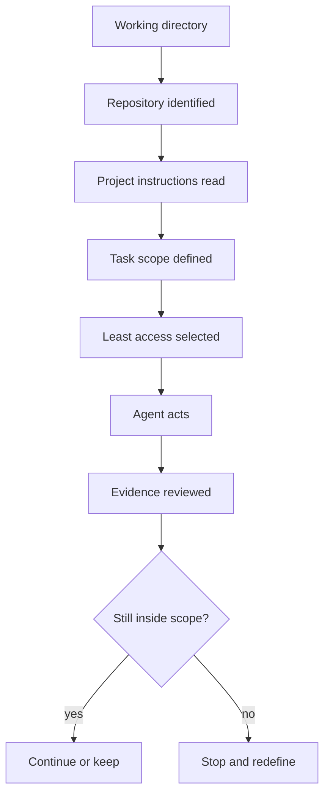

By now, "give the agent access" should sound too vague.

Access to **what**?

From **where**?

Under **which project rules**?

For **which task**?

With **which actions available**?

That is the checkpoint for this chapter.

Before an agent starts meaningful work, you should be able to describe the session as a bounded system.

## The bounded session model



The strongest part of this model is not any single box.

It is that **scope is checked before and after action**.

An agent session can begin well and still drift.

## Scenario: the task expands

You begin with:

```text
Task:
Find why the course card title is incorrect.
Do not modify files.
```

You establish:

```text
workspace: /projects/course-site
read: allowed
write: blocked
execute: blocked
network: blocked
```

The agent inspects the repository and reports:

```text
The displayed title comes from an old hard-coded fallback.
The canonical metadata is correct.
Fixing this properly requires changing the CourseCard component.
```

Did the agent fail?

No.

Did the task change?

Yes.

Your original task was investigation.

Now you have new information and a proposed modification.

The correct next move is a new decision:

```text
Do I authorize the component change?
What file is allowed?
Do I need execute permission for verification?
What evidence should be produced?
```

This is controlled escalation.

It is much safer than starting every investigation with maximum access "just in case."

## Least access is dynamic

Least access does not mean every session must remain read-only.

It means access should track the real task.

### Investigation

```text
READ      allowed
WRITE     blocked
EXECUTE   blocked unless needed to inspect behavior
NETWORK   blocked unless current external information is required
```

### Confirmed source edit

```text
READ      allowed
WRITE     allowed within defined project scope
EXECUTE   targeted verification if needed
NETWORK   blocked unless the task requires it
```

### Dependency research

```text
READ      allowed
WRITE     blocked during research
EXECUTE   maybe not needed
NETWORK   allowed to approved/current documentation sources as needed
```

The boundary changes because the purpose changes.

Not because the agent asked nicely.

## Instructions and permissions should agree

Weak setup:

```text
instruction: do not modify anything
write permission: broad access
```

Better setup when the environment supports it:

```text
instruction: do not modify anything
write permission: blocked
```

Weak setup:

```text
instruction: run the targeted test
execute permission: blocked
```

That may be fine initially, but you know the task cannot complete until you make an explicit execute decision.

The important thing is that the mismatch is visible.

## Session preflight

Use this before agent work that matters:

```text
[ ] I know the working directory.
[ ] I confirmed this is the correct repository or project.
[ ] I checked the starting Git state.
[ ] I read the project instructions that apply.
[ ] The task has a clear goal.
[ ] The allowed area is named.
[ ] Protected areas are named where needed.
[ ] The stop condition is clear.
[ ] Read access matches the task.
[ ] Write access matches the task.
[ ] Execute access matches the task.
[ ] Network access matches the task.
[ ] I know what evidence I expect afterward.
```

You will not need to ceremonially read this entire list before every tiny command forever.

The point is to practice until these checks become normal operator habits.

## Chapter artifact: bounded agent session plan

Take one task you genuinely expect to use later and complete the final version.

```text
PROJECT

WORKING DIRECTORY

STARTING GIT STATE

PROJECT INSTRUCTIONS

TASK GOAL

ALLOWED AREA

PROTECTED AREA

READ BOUNDARY

WRITE BOUNDARY

EXECUTE BOUNDARY

NETWORK BOUNDARY

STOP CONDITION

EXPECTED FILE EVIDENCE

EXPECTED GIT EVIDENCE

EXPECTED VERIFICATION

HUMAN REVIEW DECISION
```

Then write one sentence:

> The most powerful permission this task actually needs is __________ because __________.

That sentence forces you to connect capability to purpose.

## Chapter check

You are ready to enter the provider chapters when you can explain:

1. Why current working directory changes repository context.
2. Why Git state should be checked before agent work.
3. Why durable project rules should not live only in a one-off prompt.
4. Why task instructions and project instructions serve different jobs.
5. Why instructions express intent while permissions constrain capability.
6. Why read, write, execute, and network decisions should follow the task.
7. Why scope expansion should trigger a new human decision.
8. Why more access is not automatically more productive.

## What comes next

The next chapters apply this operating model to real provider interfaces.

You will see different commands, different permission terminology, and different session controls.

Do not let those product differences erase the model you just built.

For each provider, keep asking:

```text
Where am I?
What context is loaded?
What instructions apply?
What can the agent do?
What needs approval?
What evidence can I inspect?
```

That is how you learn a tool without becoming dependent on one version of its menu.

## Reflection

What is one permission you would now delay until after inspection instead of granting at the beginning of a session?

What changed your reasoning?