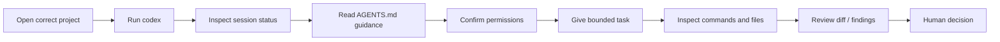

You already know the important part.

Before this chapter, you learned to ask:

```text
Where am I?
What project is this?
What instructions apply?
What can the agent read, write, execute, or reach?
What evidence will prove what happened?
```

Now we put an actual product around that model.

**Codex CLI** is OpenAI's command-line coding agent. It can work against a local repository, inspect files, make edits, and run tools available on the machine, subject to the permissions and sandbox configuration of the session.

The mistake would be treating that sentence as a reason to immediately ask it to build something.

This chapter does the opposite.

We begin with operation.



## What Codex adds to the model

Codex gives us concrete controls for ideas you already learned.

| OTS-320 concept | Codex example |
| --- | --- |
| Start inside the correct project | run `codex` from the project directory |
| Inspect active session context | `/status` |
| Choose what the agent may do | `/permissions` |
| Create repository instructions | `/init` creates an `AGENTS.md` file |
| Review changes deliberately | `/review` |
| Keep work reversible | use Git checkpoints, status, and diffs |

These commands are useful because they make the operating model visible.

They are not the operating model itself.

If OpenAI changes a command later, the deeper questions survive.

## Interactive Codex vs ordinary chat

When you run:

```text
codex
```

inside a project directory, you are entering an interactive agent session tied to a working environment.

That changes the shape of a request.

Chat request:

```text
Explain why this React component might fail.
```

Repository-agent request:

```text
Inspect the project and identify why the course card title is incorrect.
Do not modify anything yet.
Return the source file, the display path, and the smallest likely fix.
```

The second request is stronger because Codex can inspect the project instead of reasoning only from whatever fragment you pasted into a chat.

It is also stronger because you explicitly separated investigation from modification.

## Codex is not evidence about itself

A Codex response such as:

```text
I inspected the repository and found the problem.
```

is still a claim.

You want the session to produce things you can verify:

```text
working directory
files inspected
project instructions
Git status
commands requested
permission decisions
diff
verification output
review findings
```

The chapter artifact is built from those pieces.

<TakeawayStrip tone="teacher">
  The goal is not to learn how to make Codex feel powerful. The goal is to make Codex work visible enough that you can decide what to trust.
</TakeawayStrip>

## A useful first-session posture

For an unfamiliar repository, a good first task is boring:

```text
Tell me what this project is.
Inspect the repository first.
Do not modify files.
Report the main entry points, project instructions, important scripts, and current Git state.
```

Why start there?

Because it tests several things at once:

- you launched in the intended project,
- Codex can see the expected files,
- project instructions are discoverable,
- the repository has understandable structure,
- no write access is required yet,
- you can compare the agent's explanation to visible source evidence.

That is a much better first contact than:

```text
clean this whole repo up
```

## Project instructions matter immediately

OpenAI documents `AGENTS.md` as a project-instruction mechanism for Codex.

Codex reads instruction files before doing work and can combine guidance from global scope, repository scope, and nested directories down toward the current working directory.

That means the repository can carry durable rules such as:

```text
- inspect before editing
- protect authored curriculum
- do not deploy from this task
- use current first-party documentation for provider claims
- show the diff before declaring success
```

Those rules are not magic security controls.

They are durable operating context.

Permissions still matter separately.

## Sandbox and approval are different controls

This distinction is important enough to repeat.

Codex documents two layers:

**Sandbox mode** controls what Codex can technically access or modify while commands run.

**Approval policy** controls when Codex must stop and ask before an action proceeds.

Those are not interchangeable.

A session can have a narrow sandbox with few prompts.

A session can have a broader sandbox with more approval checkpoints.

Your task determines which combination makes sense.

Later in the chapter we will look at current documented examples, but do not memorize flags as if they are permanent law.

## Review is part of the workflow

Codex exposes a dedicated `/review` workflow that can examine changes and report findings without modifying the working tree during the review operation.

That does not replace your own diff review.

It gives you another evidence-producing pass.

A good sequence looks like:

```text
agent makes bounded change
        ↓
git diff
        ↓
targeted verification
        ↓
/review
        ↓
human inspection
        ↓
keep / revise / revert
```

The agent does not get to approve its own work just because the same product also has a review feature.

## What this chapter will not do

We are not going to:

- dump every Codex flag into a glossary,
- teach dangerous bypass modes as shortcuts,
- pretend current syntax will never change,
- require a live account for the foundational lab,
- treat successful agent output as proof,
- compare Codex to Claude or AGY yet.

The cross-agent comparison comes later.

Here, the goal is to understand one tool well enough to operate it deliberately.

## Chapter path

You will move through four decisions:

1. **Starting Codex in a repository**
   - correct directory
   - Git state
   - project identity
   - project instructions

2. **Permissions, status, and review**
   - `/status`
   - `/permissions`
   - sandbox vs approval policy
   - `/review`

3. **Inspection lab**
   - use the deterministic Codex fixture
   - inspect the repository
   - observe evidence events
   - trigger blocked boundaries

4. **Evidence checkpoint**
   - build a Codex inspection and review record
   - distinguish what Codex claimed from what you verified

## Build: your Codex operating card

Start a note with these fields:

```text
CODEX SESSION

Project:

Working directory:

Starting Git state:

Project instructions:

Task:

Permission boundary:

Evidence I expect:

Stop condition:
```

You will complete it across the chapter.

## Source and version note

Provider-specific behavior in this chapter was checked against current official OpenAI Codex documentation on 2026-08-15. Technical commands are backed by `docs/architecture/ots-320-evidence/codex-cli.json`.

Official source families used here:

- Codex CLI documentation
- Custom instructions with `AGENTS.md`
- Agent approvals and security

Recheck version-sensitive permission flags before using this material as live installation guidance.

## Reflection

What information would you want Codex to show you **before** you let it make the first edit in a repository you care about?