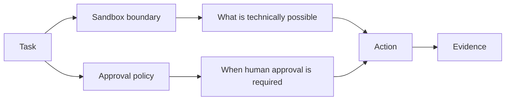

Codex does not have one switch called **safe**.

It has multiple controls that answer different questions.

That matters because a lot of bad agent operation comes from collapsing everything into:

```text
Do I trust Codex?
```

That question is too large to be useful.

Use smaller questions:

```text
What can this session technically touch?
When must it stop and ask me?
What is the current session configuration?
How will I review what changed?
```

## Start with `/status`

Current Codex documentation exposes:

```text
/status
```

for displaying current session configuration.

Think of `/status` as an orientation command.

Before meaningful work, use it to verify that the session you think you are running is the session you are actually running.

Your evidence record should be able to answer:

```text
workspace:
permission posture:
model / session information relevant to the task:
```

You do not need to copy every line of status output into a notebook.

Record the information that affects the task.

## `/permissions` is a decision surface

Current Codex documentation also exposes:

```text
/permissions
```

The course uses this command to reinforce the model from Chapter 2.

If the task is only:

```text
Explain how this repository is structured.
```

then a read-oriented posture makes sense.

If the task becomes:

```text
Correct one confirmed metadata field and show the diff.
```

then write access may become justified.

The permission decision changed because the **task changed**.

Not because the session had been open for ten minutes.

## Sandbox mode and approval policy are separate

OpenAI's current security documentation describes two layers.

### Sandbox mode

The sandbox controls what Codex can technically do while model-generated commands execute.

Examples include whether the workspace is writable and whether network access is available.

### Approval policy

Approval policy controls when Codex must stop and request permission before an action proceeds.

These controls work together, but they are not the same.



A useful operator understands both layers.

## Current documented examples

As of this course verification date, OpenAI documents a read-only example:

```text
codex --sandbox read-only --ask-for-approval on-request
```

and a workspace-write example:

```text
codex --sandbox workspace-write --ask-for-approval on-request
```

These are **version-sensitive examples**.

Do not memorize them as eternal syntax.

Use them to understand the architecture:

```text
sandbox = capability boundary
approval = decision boundary
```

The same official documentation also explains that network access is off by default in the ordinary local workspace-write model unless explicitly enabled.

That makes network a distinct decision instead of an invisible side effect.

## Why read-only is useful

Suppose you are opening a repository you did not build.

Your first goal is:

```text
Map the routing system and tell me where course titles come from.
```

You do not need the agent to modify anything yet.

A read-only posture creates a useful mismatch if the agent tries to cross the task boundary.

The request says:

```text
investigate
```

The environment says:

```text
ordinary writes are not available
```

That is stronger than instruction alone.

## Why workspace-write can be appropriate

Now suppose the investigation confirms:

```text
The title comes from course.json.
The fix is one field.
```

You create a new task:

```text
Change only the confirmed title field in course.json.
Do not rename routes or edit lesson bodies.
Show the diff afterward.
```

A workspace-write posture may now fit the task.

The important part is not that workspace-write is "better."

It is that the capability matches the requested state change.

## Approval prompts are not obstacles

Imagine Codex wants to run a command that crosses the current boundary.

Bad habit:

```text
approve -> approve -> approve -> just let me finish
```

Better habit:

```text
What action is being requested?
Why does this task need it?
What will it touch?
What evidence will I inspect after it runs?
```

If you cannot answer those questions, you are not ready to approve the action yet.

Sometimes the correct response is:

```text
Do not run that. Explain why you think it is necessary.
```

That is normal operation.

## The dangerous bypass belongs in the warning box

Codex currently documents an elevated-risk bypass mode that removes sandbox and approval protections.

The evidence library records it as:

```text
codex-dangerous-full-access
```

This course does **not** use that mode as a normal workflow.

Do not teach bypass flags as the answer to annoying permission prompts.

If someone removes both the sandbox and approvals, they have changed the security architecture of the session, not merely made the interface faster.

<RealityCheck title="Fewer prompts can mean fewer decision points">
  A permission prompt may be irritating, but bypassing the mechanism removes the point where a human could have noticed a scope change, network request, or command outside the intended boundary. Convenience is not the same as control.
</RealityCheck>

## `/review` is not self-approval

Current Codex documentation exposes:

```text
/review
```

as a dedicated review workflow.

The current docs describe review targets that can include:

- uncommitted changes,
- a commit,
- a base branch.

The review operation reports findings without modifying the working tree during that review.

That is useful.

But the logic should be:

```text
Codex made or inspected a change
        ↓
I inspect git diff
        ↓
I run targeted verification
        ↓
I may use /review for another analysis pass
        ↓
I decide what to keep
```

Not:

```text
Codex changed it
        ↓
Codex reviewed itself
        ↓
ship it
```

The tool can produce a second analysis.

The human still owns acceptance.

## Review the diff, not just findings

Suppose `/review` reports:

```text
No critical issues found.
```

That does not answer:

- Did the agent change only the requested file?
- Did the wording preserve instructional meaning?
- Did a refactor make the code harder for you to maintain?
- Did a course title change somewhere you did not intend?
- Did a technically valid edit violate a local project rule?

Those questions still require source and diff review.

## Build: permission and review decision record

Take one task and complete:

```text
TASK

CURRENT STATUS I NEED TO CONFIRM

SANDBOX INTENT
read-only / workspace write / other documented mode

WHY THIS CAPABILITY IS NEEDED

APPROVAL INTENT
What actions should stop for human approval?

NETWORK
needed / not needed
why?

PROTECTED AREAS

EXPECTED DIFF

TARGETED VERIFICATION

/REVIEW PURPOSE
What additional question should the review pass answer?

FINAL HUMAN DECISION
What would make me keep, revise, or revert the change?
```

## A practical decision table

| Task | Likely starting posture | Why |
| --- | --- | --- |
| Explain project structure | read-oriented | no state change needed |
| Find source of a bug | read-oriented first | investigation before mutation |
| Correct one confirmed file | workspace write may be justified | bounded state change required |
| Check current external docs | network may be required | task depends on outside/current information |
| Rewrite whole repository | stop and rescope | too broad to review safely |

This table is not a product configuration matrix.

It is task reasoning.

## Source and version note

This lesson's current Codex claims were rechecked against official OpenAI Codex CLI and Agent approvals & security documentation on 2026-08-15.

Evidence IDs:

```text
codex-session-status
codex-session-permissions
codex-read-only-on-request
codex-workspace-write-on-request
codex-review
codex-dangerous-full-access
```

The explicit sandbox flag examples are marked volatile in the repository evidence library and should be rechecked before publication or live instruction.

## Reflection

Which is easier for you to confuse: **what Codex can technically do** or **when Codex has to ask first**?

Write one sentence explaining the difference without using the words "sandbox" or "approval."