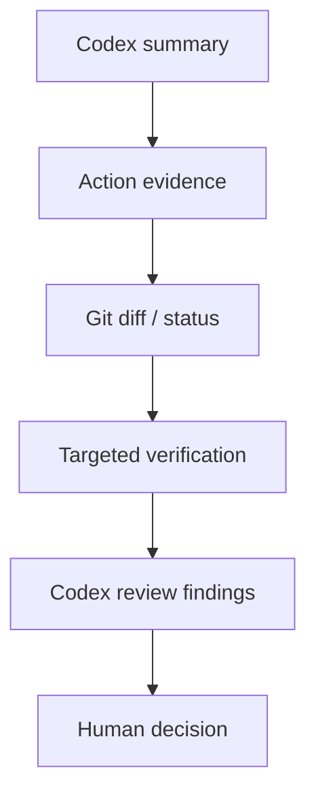

A Codex session can feel productive long before you know whether it was controlled.

The agent may explain the project well.

It may sound confident about the cause of a bug.

It may tell you a change is complete.

This checkpoint asks a narrower question:

> **What can you prove Codex actually did?**

That question is the bridge between using a coding agent and operating one.

## Build the record from evidence, not memory

Your Chapter 3 artifact should contain five layers.

```text
1. CONTEXT
2. INSTRUCTIONS
3. PERMISSIONS
4. ACTIONS
5. REVIEW
```

Each layer should point to something observable.

## 1. Context

Record:

```text
working directory:
project identity:
starting Git state:
```

Evidence might include:

```text
pwd
git status
README.md
package.json
```

The important question is:

> Did Codex begin in the repository you intended?

A technically successful session in the wrong clone is still failed work.

## 2. Instructions

Record the project guidance that applied.

For the training fixture:

```text
AGENTS.md
```

contains rules such as inspecting before modification and protecting authored content from generated filler.

Codex currently documents `AGENTS.md` as project guidance it reads before work.

But your record should not merely say:

```text
Codex uses AGENTS.md.
```

Write the actual relevant rule:

```text
Relevant instruction:
Show the diff before claiming a change is complete.
```

That lets you later check whether the session behavior matched the instruction.

## 3. Permissions

Record what the session could do.

```text
read:
write:
execute:
network:
```

Then distinguish two questions:

```text
What could the sandbox technically allow?
When would approval be required?
```

This is the Codex-specific version of Chapter 2's capability-vs-decision model.

Do not write:

```text
permissions looked safe
```

That is too vague to audit later.

## 4. Actions

Now list what actually happened.

Example from the training fixture:

```text
READ AGENTS.md
READ README.md
READ package.json
READ src/data/sample-lessons.json
EXECUTE npm test -> blocked
WRITE -> none
NETWORK -> none
```

This is stronger than:

```text
Codex inspected the project safely.
```

The first version is evidence-shaped.

The second is an interpretation.

You need both, but do not confuse them.

## 5. Review

Finish with repository evidence.

```text
git status
git diff
```

Then, where useful:

```text
/review
```

The current Codex review workflow can inspect changes and report findings without modifying the working tree during review.

But remember the review hierarchy:



`/review` is one analysis layer.

It is not the final authority.

## Scenario: Codex says "done"

Suppose a future live task is:

```text
Correct one course title in course.json.
Do not modify lesson bodies or routes.
Run the targeted metadata check and show the diff.
```

Codex reports:

```text
Done. I corrected the title and verified the course.
```

You inspect:

```text
git status
```

and find:

```text
modified: content/courses/ots-320/course.json
modified: src/lib/courseStructures.ts
```

The agent's summary is incomplete.

It touched an extra file.

That does not automatically mean the second change is wrong.

It means you have a scope decision to make.

Your options include:

- inspect and accept both changes,
- keep the intended change and revert the extra one,
- ask Codex why the extra change was necessary,
- redefine the task if the architecture genuinely requires both.

What you should **not** do is ignore the diff because the agent said verification passed.

## Scenario: checks pass but the lesson is worse

Suppose Codex changes a lesson file.

The build passes.

TypeScript passes.

The route loads.

But the lesson becomes generic and loses the teacher-facing explanation that made it useful.

Technical evidence says:

```text
site still functions
```

Human review says:

```text
instructional quality regressed
```

Both statements can be true.

This is exactly why OTS-320 does not teach "tests passed" as the finish line.

## Your Codex inspection and review record

Complete the final artifact:

```text
CODEX SESSION

DATE:

PROJECT:

WORKING DIRECTORY:

STARTING GIT STATE:

PROJECT INSTRUCTIONS THAT APPLIED:

TASK:

STOP CONDITION:

STATUS EVIDENCE:

PERMISSION BOUNDARY:
read:
write:
execute:
network:

FILES READ:

FILES WRITTEN:

COMMANDS EXECUTED:

NETWORK ACTIONS:

BLOCKED OR APPROVAL-REQUIRING ACTIONS:

ENDING GIT STATUS:

DIFF SUMMARY:

TARGETED VERIFICATION:

/REVIEW FINDINGS:

HUMAN REVIEW:

DECISION:
keep / revise / revert / investigate further
```

For the embedded lab, several fields should say:

```text
none
blocked
not required
```

That is valid evidence.

Do not invent activity to make the record look more impressive.

## Chapter check

You are ready to leave the Codex chapter when you can explain all of these:

1. `codex` starts the interactive CLI from the project context you choose.
2. `/status` helps inspect current session configuration.
3. `/permissions` exposes the permission decision surface.
4. Sandbox mode and approval policy solve different control problems.
5. `/init` can create `AGENTS.md`, but useful project instructions still require human judgment.
6. Codex can layer `AGENTS.md` guidance from broader to more local project scope.
7. `/review` is an additional analysis pass, not automatic authorization to ship.
8. Git status and diffs remain critical evidence even when Codex reports success.
9. Dangerous bypass modes are architecture changes, not convenience defaults.
10. A live Codex result and an OTS-320 emulated fixture are different evidence classes.

## Transfer test

Without looking back, explain how you would start a Codex investigation in a repository you care about.

A strong answer should sound roughly like:

```text
I confirm the project directory and Git state first.
I launch Codex inside that project.
I inspect status and project instructions.
I choose a permission posture that matches the task.
I ask for investigation before modification when the source of the problem is unclear.
I inspect files, commands, Git evidence, and any review findings myself before deciding what to keep.
```

The wording does not matter.

The sequence does.

## Source and version note

Provider-specific behavior in this chapter was rechecked on 2026-08-15 against official OpenAI Codex CLI, `AGENTS.md`, and Agent approvals & security documentation.

The current evidence set lives in:

```text
docs/architecture/ots-320-evidence/codex-cli.json
```

Version-sensitive flags remain marked volatile and must be rechecked before future publication.

## Next chapter

Next you will apply the same operating model to **Claude Code**.

Do not carry Codex command names into that chapter and assume they are universal.

Carry the questions instead:

```text
Where am I?
What instructions apply?
What can the agent do?
What needs permission?
What evidence shows what happened?
```

## Reflection

What part of a Codex session would you trust least if you could not see Git status or a diff afterward?

Why?