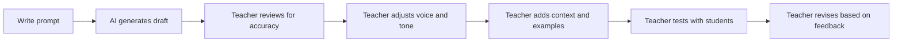

# AI as a Curriculum Assistant

AI tools — Claude, ChatGPT, Gemini — are powerful curriculum assistants. They can draft lesson outlines, generate quiz questions, suggest analogies, and restructure content in minutes.

But they are assistants, not authors. The distinction matters.

## What AI Does Well for Teachers

- **Drafting** — Generate a first draft of a lesson plan, rubric, or quiz in seconds
- **Variation** — Create multiple versions of the same assessment at different difficulty levels
- **Reformatting** — Convert a lesson outline into a slide structure, a study guide, or a parent summary
- **Brainstorming** — Suggest analogies, examples, discussion questions, or project ideas
- **Editing** — Proofread, simplify language, adjust reading level

## What AI Does Poorly

- **Accuracy** — AI can generate plausible-sounding content that is factually wrong
- **Pedagogy** — AI does not understand how students learn; it generates content, not instruction
- **Voice** — AI-generated text sounds like AI unless you actively shape it
- **Context** — AI does not know your students, your school culture, or your instructional goals
- **Standards alignment** — AI can reference standards but cannot verify alignment with the precision a teacher needs

<RealityCheck>
Never publish AI-generated curriculum content without reviewing every claim, every example, and every question for accuracy. AI is a draft generator, not a fact checker. You are the subject matter expert. The AI is not.
</RealityCheck>

## Effective Prompting for Curriculum

The quality of AI output depends on the quality of your prompt. Good curriculum prompts include:

1. **Role** — "You are a curriculum writer for a high school computer science course."
2. **Context** — "This lesson is for 10th graders who have never written code."
3. **Specific task** — "Write 5 multiple-choice questions about DNS, each with 4 options."
4. **Constraints** — "Use simple language. Avoid jargon. Each question should test understanding, not recall."
5. **Format** — "Return the questions in a table with columns: Question, A, B, C, D, Correct Answer."

### Example Prompt

```
You are a curriculum writer for a teacher professional development course 
about digital infrastructure.

Write a 45-minute lesson outline on "What Is a Domain?" for teachers 
who have no technical background.

Include:
- 3 learning objectives
- An opening hook (2 minutes)
- A main explanation with an analogy (15 minutes)
- A guided activity (15 minutes)
- A reflection question (5 minutes)
- 3 recommended readings

Use clear, professional language. Avoid ed-tech jargon.
```

## The Review Workflow



AI generates. You review, refine, and own the final product. Every time.

## Voice Preservation

AI-generated content tends to sound generic. To preserve your voice:

- Feed the AI examples of your existing writing
- Specify tone in your prompt: "Write in a direct, practical tone. No inspirational language."
- Edit the output to sound like you, not like a marketing brochure
- Remove phrases like "In today's fast-paced world" or "Let's dive in"

<TeacherNote>
The goal is not to use AI less or more — it is to use it deliberately. A teacher who uses AI to draft a quiz and then reviews every question is working smarter. A teacher who pastes AI output directly into a Form without checking is being irresponsible. Teach the workflow, not just the tool.
</TeacherNote>

<BuildTask>
Use an AI tool to generate a 10-question quiz on a topic you teach.

1. Write a detailed prompt with role, context, task, constraints, and format
2. Review every question for accuracy
3. Identify at least one error or improvement needed
4. Revise the output and format it for your question bank spreadsheet

Estimated time: 25 minutes
</BuildTask>
