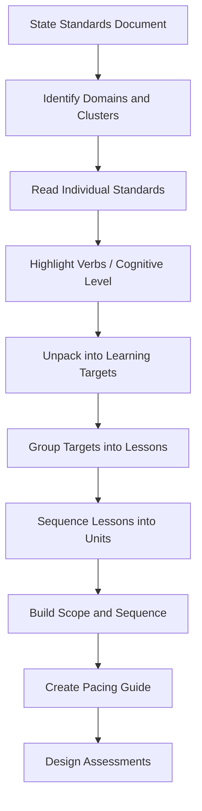

# Building Courses from Standards

Every curriculum starts with standards. But most teachers have a complicated relationship with them.

Standards documents are dense, abstract, and written in committee language. They describe what students should know and be able to do, but they do not tell you how to teach it, in what order, or how to assess it. That is your job.

The gap between "here are your standards" and "here is a course that works" is where curriculum design happens. This lesson is about crossing that gap deliberately.

## How to Read a Standards Document

Standards documents are not meant to be read like a book. They are reference documents — structured, hierarchical, and designed to be unpacked.

Most state standards follow a structure like this:

```
Domain / Strand
  └── Cluster / Standard Group
        └── Individual Standard
              └── Sub-standards or Indicators
```

**Example (generic structure):**
```
Computing Systems (Domain)
  └── Devices (Cluster)
        └── Standard 2.1: Students will explain how hardware and 
            software work together to complete tasks.
              └── 2.1.a: Identify common hardware components
              └── 2.1.b: Describe the role of the operating system
```

When reading a standards document:

1. **Start with the domains.** These are your major units or themes.
2. **Read the clusters.** These group related standards and suggest natural lesson groupings.
3. **Read individual standards carefully.** Pay attention to the verbs — they tell you the cognitive level expected.
4. **Ignore the numbering order.** Standards are numbered for reference, not for teaching sequence. You decide the order.

<TeacherNote>
Print the standards document — or at least the page covering your course. Highlight the verbs in every standard. Those verbs are your roadmap: identify, explain, analyze, design, evaluate. They tell you what students must do, not just what they must know.
</TeacherNote>

## Unpacking Standards into Learning Targets

A standard is too broad to teach directly. You need to unpack it into learning targets — specific, measurable statements that guide a single lesson or a short sequence of lessons.

**The unpacking process:**

| Standard says... | You unpack into... |
|-----------------|-------------------|
| "Analyze the impact of computing innovations on society" | LT1: Identify three computing innovations and their intended purpose. LT2: Describe one positive and one negative impact of a specific innovation. LT3: Evaluate whether the benefits of a specific innovation outweigh its risks, using evidence. |

**Rules for learning targets:**

- Each target should be achievable in 1-3 lessons
- Each target uses a measurable verb (not "understand" or "appreciate")
- Each target can be assessed — if you cannot write a question or task that measures it, rewrite it
- Targets build on each other: identify before analyze, describe before evaluate



## Aligning Standards to Lessons

Alignment means every lesson connects to at least one standard, and every standard is addressed by at least one lesson. This sounds simple. It is not.

Common alignment problems:

- **Orphan standards** — Standards that appear in your scope and sequence but never get taught. They fall through the cracks because no lesson explicitly targets them.
- **Phantom alignment** — A lesson claims to address a standard, but the activities do not actually require the cognitive level the standard demands. A lesson that asks students to "identify" when the standard says "evaluate" is not aligned.
- **Coverage without depth** — Touching every standard once is not alignment. Students need multiple exposures, practice, and assessment opportunities.

**A practical alignment check:**

For each lesson, ask:
1. Which learning target(s) does this lesson address?
2. Which standard(s) do those targets unpack?
3. Does the lesson activity require the same verb the standard uses?
4. Will students produce something I can evaluate against this standard?

If you cannot answer all four, the lesson is not aligned. Fix it or cut it.

<RealityCheck>
Perfect alignment is a planning fiction. In practice, some lessons serve multiple standards, some standards get addressed incidentally, and some standards require more time than you have. The goal is intentional alignment — knowing where every standard lives in your course and making deliberate choices about depth versus breadth.
</RealityCheck>

## Building Scope and Sequence

A scope and sequence is the master plan for your course. Scope is what you teach. Sequence is the order you teach it.

**Step 1: List your standards and learning targets.**

Put them in a spreadsheet. Columns: Standard Code, Standard Text, Unpacked Learning Targets, Bloom's Level, Unit Assignment.

**Step 2: Group targets into units.**

Look for natural clusters — standards that share a domain, build on each other, or connect thematically. These become your units.

**Step 3: Sequence the units.**

Consider:
- **Prerequisite knowledge** — Which concepts must come first?
- **Spiral design** — Can you revisit earlier concepts in later units?
- **Assessment timing** — When do major assessments need to happen (quarter breaks, state testing windows)?
- **Student engagement** — Can you front-load an engaging unit to hook students early?
- **Seasonal factors** — Do any topics align with current events, holidays, or school calendar events?

**Step 4: Estimate time.**

For each unit, estimate the number of instructional days. Be realistic:

- A one-day lesson is 1 class period of actual instruction
- A five-day unit is one school week
- Budget time for review, assessment, re-teaching, and the inevitable fire drill day
- Most teachers overestimate what they can cover by 20-30%

<TeacherNote>
Start your scope and sequence in a spreadsheet, not a document. Spreadsheets let you sort, filter, and rearrange. A Google Sheet with columns for standard, target, unit, sequence number, and estimated days becomes your planning database.
</TeacherNote>

## Building a Pacing Guide

A pacing guide turns your scope and sequence into a calendar. It maps units and lessons to specific weeks of the school year.

**Pacing guide structure:**

```
Week | Dates       | Unit                  | Lessons / Topics        | Standards  | Assessment
-----|-------------|-----------------------|-------------------------|------------|------------
1    | Aug 12-16   | Unit 1: Foundations    | L01: Course overview    | None       | Pre-assessment
2    | Aug 19-23   | Unit 1: Foundations    | L02: Digital citizenship| CS.1.1     | Discussion
3    | Aug 26-30   | Unit 2: Digital Home   | L03: What is a domain   | CS.2.1     | Exit ticket
...
```

**Pacing realities:**

- Build in buffer weeks. Plan for 32-34 weeks of instruction in a 36-week year. Assemblies, testing, snow days, and professional development will consume the rest.
- Front-load essentials. If state testing happens in April, every tested standard must be taught by March.
- Mark assessment dates first. Work backward from summative assessments to determine when instruction must be complete.
- Include re-teach windows. Plan explicit time to revisit standards where students struggle.

## Avoiding "Standards-Copy" Curriculum

The most common mistake in standards-based curriculum is copying the standard into a lesson plan and calling it aligned.

**What standards-copy looks like:**

- Learning objective: "Students will analyze the impact of computing innovations on society." (This is just the standard, pasted in.)
- Lesson activity: Read an article. Discuss. (This does not require analysis.)
- Assessment: Multiple-choice quiz on vocabulary. (This tests recall, not analysis.)

The standard was copied. It was not unpacked, not taught, and not assessed at the right cognitive level.

**What aligned curriculum looks like:**

- Learning target: "Students will evaluate whether the benefits of social media outweigh its risks for teenagers, using at least three pieces of evidence."
- Lesson activity: Students read two sources (one pro, one con), identify claims and evidence, then write a one-paragraph argument.
- Assessment: Students present their argument and respond to a counterargument from a peer.

The standard was unpacked into a specific target, the activity requires the cognitive level the standard demands, and the assessment measures whether students met the target.

<ReflectionPrompt>
Pull up the standards for a course you teach. Pick one standard and try to unpack it into 2-3 learning targets. Can you write a specific assessment task for each target? If not, the target is probably still too vague.
</ReflectionPrompt>

## The Standards Spreadsheet

Build a master spreadsheet for your course. This becomes the single source of truth for your curriculum:

| Column | Purpose |
|--------|---------|
| Standard Code | Reference number (e.g., CS.3.2.a) |
| Standard Text | Full text of the standard |
| Domain / Strand | For filtering and grouping |
| Bloom's Level | Cognitive level the standard requires |
| Learning Target(s) | Your unpacked, measurable targets |
| Unit | Which unit addresses this standard |
| Lesson(s) | Which specific lessons teach this target |
| Assessment | How you measure whether students met this target |
| Notes | Your observations, adjustments, re-teach needs |

This spreadsheet is the backbone of your course. Update it as you teach. It becomes more valuable every semester.

## Recommended Resources to Curate

- Your state department of education standards page (every state publishes these online)
- Achieve.org standards resources and alignment tools
- Understanding by Design framework (Wiggins and McTighe) for backward design methodology
- Bloom's Taxonomy verb charts for writing learning objectives
- OER Commons for standards-aligned open resources
- Your district's curriculum office for local pacing guides and scope and sequence documents

<BuildTask>
Build a standards alignment spreadsheet for one unit of a course you teach:

1. Find your state standards document for the relevant subject and grade level
2. Identify 3-5 standards that belong in one unit
3. Unpack each standard into 1-3 learning targets
4. For each target, write one assessment task that measures it
5. Estimate the number of instructional days the unit requires

Use a Google Sheet with the column structure described in this lesson. This spreadsheet will become the foundation for your scope and sequence.

Estimated time: 40 minutes
</BuildTask>
