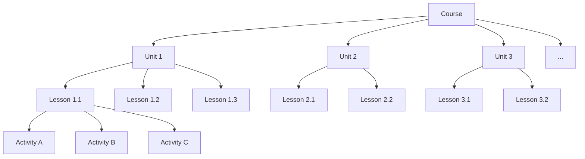

# Course Architecture

A course is not a collection of lesson plans. A course is a structure — designed, sequenced, and held together by intentional decisions at every level.

Most teachers inherit courses. Someone else built the scope and sequence. Someone else chose the textbook. Someone else made the pacing guide. The teacher fills in the gaps, improvises, and survives.

This lesson is about building a course from the structure down, so you know why every piece is where it is.

## The Hierarchy

Every well-designed course has four levels:



| Level | What It Is | Typical Duration | Defined By |
|-------|-----------|-----------------|------------|
| **Course** | The entire learning experience | 1 semester or 1 year | Course description, scope, major outcomes |
| **Unit** | A coherent chunk focused on a theme or standard cluster | 2-4 weeks | Essential question, standards, summative assessment |
| **Lesson** | A single instructional session | 1 class period (45-90 min) | Learning objective, instruction type, formative assessment |
| **Activity** | A specific task within a lesson | 5-20 minutes | Student action, materials, deliverable |

Each level serves a different purpose. The course sets direction. Units organize the journey. Lessons deliver instruction. Activities are where students actually do things.

## Essential Questions

An essential question is the big question that anchors a unit. It is not a quiz question. It is not a factual question. It is a question that:

- Cannot be answered with a Google search
- Requires sustained inquiry across multiple lessons
- Has multiple defensible answers
- Connects to the real world
- Students revisit throughout the unit

**Examples:**

| Unit Topic | Weak Question | Essential Question |
|-----------|--------------|-------------------|
| Government | What are the three branches? | Why does power need to be divided? |
| Ecosystems | What is a food chain? | What happens when one part of a system fails? |
| Digital Citizenship | What is cyberbullying? | Where is the line between free speech and harm online? |
| DNS and Domains | What does DNS stand for? | Who controls the addresses of the internet, and should they? |

**Rules for essential questions:**

- One per unit. Maybe two. Not five.
- Post it visibly. Return to it throughout the unit.
- Use it as the frame for your summative assessment. If students can answer the essential question with evidence and nuance by the end of the unit, the unit worked.

<ReflectionPrompt>
Pick a unit you teach. What is its essential question? If you do not have one, write one now. Test it: Can a student Google the answer? If yes, it is not essential enough.
</ReflectionPrompt>

## Learning Objectives

A learning objective describes what a student will be able to do after a lesson. Not what they will "understand" or "appreciate" — what they will do.

**The formula:**

> Students will [measurable verb] + [specific content] + [conditions or criteria].

**Examples:**

- "Students will identify three hardware components and describe the function of each."
- "Students will write a DNS lookup query and explain each step of the resolution process."
- "Students will evaluate two AI-generated lesson plans and identify at least one factual error in each."

**Verbs that work (measurable):**

| Bloom's Level | Verbs |
|--------------|-------|
| Remember | List, name, identify, define, recall |
| Understand | Explain, describe, summarize, compare, interpret |
| Apply | Use, demonstrate, solve, implement, create |
| Analyze | Compare, contrast, differentiate, examine, categorize |
| Evaluate | Judge, critique, justify, assess, defend |
| Create | Design, build, construct, produce, compose |

**Verbs that do not work (not measurable):**

- Understand, appreciate, know, learn, be aware of, explore, be familiar with

You cannot measure "understanding." You can measure whether a student can explain, compare, or apply. Use the specific verb.

<RealityCheck>
Writing perfect learning objectives for every lesson is ideal. In practice, you will write good-enough objectives and refine them over time. The point is not perfection — it is intentionality. If you cannot articulate what students should be able to do after a lesson, the lesson has no clear target.
</RealityCheck>

## The Three Modes of Instruction

Every lesson balances three modes:

### Direct Instruction

The teacher presents information. Lecture, demonstration, modeling, or guided note-taking.

- **When to use it:** Introducing new concepts, demonstrating procedures, modeling thinking
- **How long:** 10-20 minutes. Rarely more. Student attention degrades after 12-15 minutes of passive listening.
- **Key rule:** Direct instruction is not reading slides aloud. It is explaining, demonstrating, and checking for understanding in real time.

### Guided Practice

Students work on a task with teacher support. The teacher circulates, answers questions, and provides feedback.

- **When to use it:** After direct instruction, when students need to practice a new skill with a safety net
- **How long:** 10-20 minutes
- **Key rule:** You should be moving. If you are at your desk during guided practice, something is wrong.

### Independent Practice

Students work without teacher support. This is where you assess whether they can actually do the thing.

- **When to use it:** After guided practice, when students have had enough scaffolded support to work alone
- **How long:** 15-30 minutes, depending on the task
- **Key rule:** Independent practice requires clear instructions. If students keep asking "what are we supposed to do?" your instructions failed, not the students.

### The Balance

A well-designed lesson typically follows a rhythm:

```
Opening Hook / Bell Ringer     →  3-5 min
Direct Instruction             → 12-15 min
Guided Practice                → 10-15 min
Independent Practice           → 15-20 min
Closure / Exit Ticket          →  3-5 min
```

Not every lesson follows this pattern. Labs, workshops, and project days look different. But this rhythm is the default — deviate from it intentionally, not accidentally.

## Assessment Types

Assessments serve different purposes. Choose the type based on what you need to know.

| Type | Purpose | When | Examples |
|------|---------|------|---------|
| **Diagnostic** | What do students already know? | Before a unit | Pre-test, KWL chart, survey |
| **Formative** | Are students learning during instruction? | During lessons | Exit ticket, observation, thumbs up/down, quick write |
| **Summative** | Did students meet the learning targets? | End of unit | Test, project, essay, presentation |
| **Performance** | Can students apply skills in context? | End of unit or course | Portfolio, capstone project, demonstration |

**Common mistakes:**

- Using only summative assessments (tests) and ignoring formative data
- Grading everything — formative assessments are for feedback, not grades
- Making summative assessments too narrow (a 20-question multiple-choice test cannot measure "evaluate" or "create")
- Not aligning assessment to the learning objective (testing recall when the objective says "analyze")

<TeacherNote>
The most underused assessment is the exit ticket. A single question at the end of a lesson — "Write one thing you learned and one thing you are confused about" — gives you more actionable data than a weekly quiz. Use exit tickets daily. Read them that evening. Adjust tomorrow's lesson based on what you learn.
</TeacherNote>

## Lesson Templates

Consistency saves time. A lesson template is a reusable structure that you fill in for each lesson, so you are not starting from a blank page every time.

**A minimal lesson template:**

```
Lesson Title: _______________
Unit: _______________
Date: _______________
Duration: _______________

Learning Objective:
Students will [verb] + [content] + [criteria].

Standards Addressed:
- [Standard code and text]

Materials:
- [List materials and links]

Lesson Flow:
1. Opening (5 min): _______________
2. Direct Instruction (15 min): _______________
3. Guided Practice (15 min): _______________
4. Independent Practice (15 min): _______________
5. Closure / Exit Ticket (5 min): _______________

Assessment:
- Formative: _______________
- Summative (if applicable): _______________

Notes / Adjustments:
_______________
```

Save this as a Google Doc template. Copy it for each new lesson. Never edit the template itself.

## Course Maps

A course map is a one-page overview of your entire course. It shows all units, their sequence, essential questions, major assessments, and approximate timing.

**Course map structure:**

| Unit | Weeks | Essential Question | Standards | Summative Assessment |
|------|-------|-------------------|-----------|---------------------|
| 1. Foundations | 1-2 | What does it mean to own your digital space? | CS.1.1, CS.1.2 | Reflective essay |
| 2. Digital Home | 3-4 | How does the internet find your website? | CS.2.1, CS.2.3 | Domain setup walkthrough |
| 3. Google Workspace | 5-7 | How do you build a system that survives? | CS.3.1-3.4 | Organized Drive architecture |
| 4. Revision | 8-10 | How do builders improve after feedback? | CS.4.1, CS.4.2 | Reflection and revision log |

A course map is not a pacing guide. A pacing guide tells you what to teach on Tuesday. A course map tells you what the course is about and how the pieces fit together.

Post your course map somewhere you will see it every day. It keeps you oriented when the daily grind pulls you off course.

## Recommended Resources to Curate

- Understanding by Design (Wiggins and McTighe) for backward design and essential questions
- Bloom's Taxonomy reference materials for writing measurable objectives
- Your state standards documents for alignment
- Your district's lesson plan template (if one exists — adapt it, do not ignore it)
- Hattie's Visible Learning research for evidence on effective instructional practices

<BuildTask>
Design the architecture for one unit of a course you teach:

1. Write one essential question for the unit
2. List 3-5 learning objectives using measurable verbs
3. Outline 4-6 lessons with the direct instruction / guided practice / independent practice structure
4. Choose one formative and one summative assessment
5. Fill in the lesson template for the first lesson of the unit

Use the template from this lesson. Build it in a Google Doc so you can reuse and refine it.

Estimated time: 40 minutes
</BuildTask>
