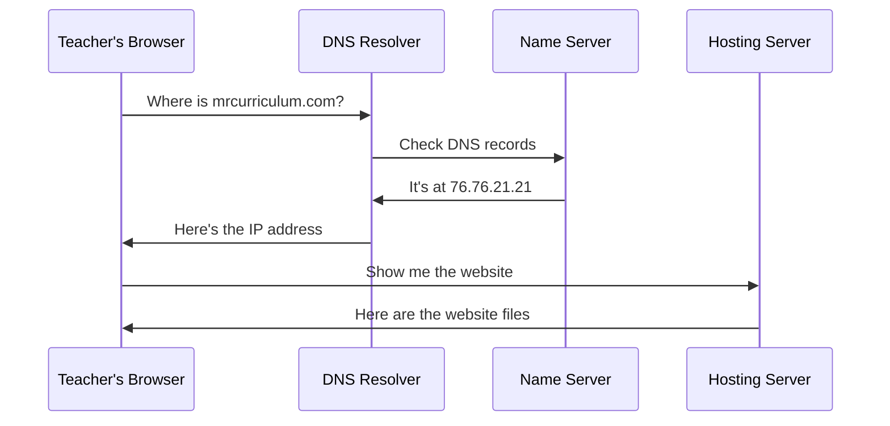

# DNS Explained for Teachers

DNS stands for Domain Name System. It is the phonebook of the internet.

When you type a domain name into your browser, DNS is the system that looks up the actual server address where that website lives. Without DNS, you would have to memorize IP addresses like `76.76.21.21` instead of typing `vercel.com`.

## How DNS Works

This happens in milliseconds. You never see it. But understanding it matters because when you buy a domain and need to connect it to your hosting, you are editing DNS records.

## DNS Record Types

You only need to know a few:

| Record | Purpose | Example |
|--------|---------|---------|
| **A** | Points domain to an IP address | `mrcurriculum.com → 76.76.21.21` |
| **CNAME** | Points domain to another domain | `www.mrcurriculum.com → mrcurriculum.com` |
| **MX** | Points domain to email servers | For Google Workspace email |
| **TXT** | Stores text data | Domain verification, SPF records |

For a basic curriculum site, you will typically set:

1. An **A record** or **CNAME** pointing your domain to your hosting provider
2. A **CNAME** for `www` pointing to the root domain

That is it. Everything else is optional until you need email or advanced features.

<RealityCheck>
DNS changes are not instant. When you update a DNS record, it can take anywhere from a few minutes to 48 hours for the change to propagate across the internet. This is called propagation. Do not panic if your site does not appear immediately after changing DNS settings.
</RealityCheck>

## Practical Example

Suppose you buy `mrcurriculum.com` on Cloudflare and want to host your site on Vercel.

1. In Vercel, you add `mrcurriculum.com` as a custom domain.
2. Vercel tells you to create an **A record** pointing to `76.76.21.21`.
3. You go to Cloudflare's DNS settings and add that A record.
4. You also add a **CNAME** record: `www` → `cname.vercel-dns.com`.
5. Wait for propagation.
6. Your site is live at `mrcurriculum.com`.

<TeacherNote>
Most hosting platforms (Vercel, Netlify, GitHub Pages) provide step-by-step instructions for connecting your domain. You do not need to memorize DNS record types — you need to know enough to follow those instructions without being confused.
</TeacherNote>

## Common DNS Mistakes

1. **Editing the wrong zone.** Make sure you are editing DNS at your registrar or wherever your nameservers point.
2. **Adding conflicting records.** Do not set both an A record and a CNAME for the root domain.
3. **Forgetting `www`.** Many visitors type `www.` before domains. Set up a CNAME or redirect.
4. **Panicking during propagation.** Wait at least an hour before troubleshooting.

<BuildTask>
If you have access to a DNS dashboard (Cloudflare, Namecheap, etc.), log in and look at the existing DNS records for any domain you own. Identify:
1. How many A records exist
2. Whether there is a CNAME for `www`
3. Whether there are MX records (email)

If you do not own a domain yet, use a free DNS lookup tool to inspect the records of `example.com`.

Estimated time: 15 minutes
</BuildTask>
