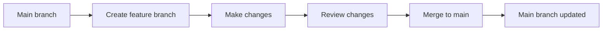

# GitHub for Teachers

GitHub is the world's largest platform for collaborative, version-controlled projects. It hosts 100+ million repositories — and an increasing number of them are not code at all. They are curricula, course materials, research papers, datasets, and educational resources.

You do not need to be a programmer to use GitHub. You need to understand three concepts: repositories, commits, and collaboration.

## What GitHub Gives Teachers

| Feature | What It Means for Teachers |
|---------|---------------------------|
| Version history | See every change ever made to your curriculum, by whom, and when |
| Collaboration | Other teachers can suggest improvements without editing your originals |
| Free hosting | GitHub Pages publishes static websites for free |
| Public sharing | Your resources are discoverable by anyone searching for your topic |
| Open source | Apply a license so others can use and contribute legally |

## Core Concepts

### Repository (Repo)
A repository is a project folder hosted on GitHub. It contains your files, their complete version history, and a README that describes the project.

Think of it as a Google Drive folder that tracks every change and lets anyone suggest edits.

### Commit
A commit is a saved snapshot of changes. Instead of saving a file repeatedly (like Google Docs autosave), you save intentional checkpoints with messages describing what changed.

Example commit messages:
- "Add quiz questions for DNS module"
- "Fix typo in domain lesson"
- "Update pacing guide for spring semester"

### Branch
A branch is a parallel copy of your project where you can make changes without affecting the original. When the changes are ready, you merge them back.

This is useful when multiple teachers collaborate — each works on a branch, then merges.

## Getting Started

### Step 1: Create a GitHub Account
Go to [github.com](https://github.com) and sign up. Use a professional username (your name, not a joke handle).

### Step 2: Create Your First Repository
1. Click the **+** button → **New repository**
2. Name it: `my-curriculum` or `course-materials`
3. Add a description
4. Check **"Add a README file"**
5. Choose a license (MIT for code, or CC BY-NC-SA 4.0 for content)
6. Click **Create repository**

### Step 3: Edit the README
The README is the front page of your repository. Click the pencil icon to edit it directly on GitHub.

A good teacher README includes:
- Course title and description
- Who the materials are for
- How to use the materials
- License and attribution

<RealityCheck>
You do not need to learn Git command-line tools to use GitHub effectively. The GitHub web interface handles most teacher workflows: creating repos, editing files, uploading resources, and managing collaborators. Learn the web interface first. Terminal skills come later, if ever.
</RealityCheck>

## Teacher Use Cases

- **Publish a course site** using GitHub Pages (free hosting)
- **Share curriculum openly** with a clear license
- **Track changes** to lesson plans across semesters
- **Accept contributions** from colleagues via pull requests
- **Archive resources** with permanent, linkable URLs

<TeacherNote>
GitHub is increasingly used in education-adjacent contexts: open textbooks, OER repositories, curriculum standards, and teacher-built tools. Having a GitHub profile with published curriculum work is a professional asset — especially for teachers who also coach STEM or CS programs.
</TeacherNote>

<BuildTask>
1. Create a GitHub account (or log in if you have one)
2. Create a new repository called `my-curriculum`
3. Write a README with: course title, description, audience, and license
4. Make one edit to the README and commit it with a descriptive message
5. Share the repository URL with a colleague

Estimated time: 20 minutes
</BuildTask>
