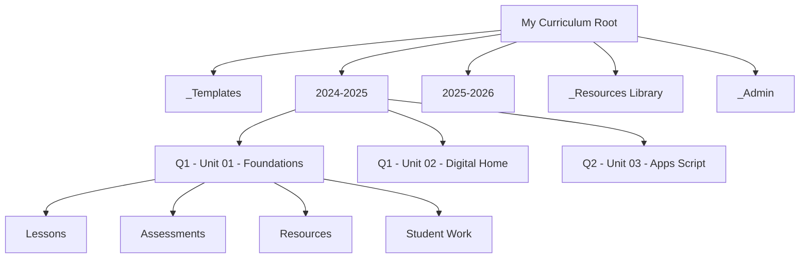

# Google Drive Folder Architecture

Most teachers do not have a folder structure. They have a folder graveyard.

Folders created in a rush. Files named `Final_v2_REAL_FINAL.docx`. Shared folders from three schools ago. A "Stuff" folder that contains everything.

Architecture is different from organization. Organization is tidying up. Architecture is designing a system that stays clean because its structure makes the right behavior easy.

## The Curriculum Folder Framework



### Root Level

```
📁 My Curriculum/
├── 📁 _Templates/
├── 📁 _Resources Library/
├── 📁 _Admin/
├── 📁 2024-2025/
└── 📁 2025-2026/
```

The underscore prefix (`_Templates`, `_Resources Library`) pushes utility folders to the top when sorted alphabetically. This is intentional.

### Year Level

```
📁 2025-2026/
├── 📁 Q1 - Unit 01 - Foundations/
├── 📁 Q1 - Unit 02 - Digital Home/
├── 📁 Q2 - Unit 03 - Teacher Stack/
├── 📁 Q2 - Unit 04 - Google Workspace/
├── 📁 Q3 - Unit 05 - Apps Script/
└── 📁 _Pacing and Planning/
```

**Naming convention:** `Quarter - Unit Number - Unit Name`

This sorts chronologically and lets you see the full scope at a glance.

### Unit Level

```
📁 Q1 - Unit 01 - Foundations/
├── 📁 Lessons/
├── 📁 Assessments/
├── 📁 Resources/
├── 📁 Student Work/
└── 📄 Unit Overview.gdoc
```

Every unit has the same four subfolders. Consistency is the point.

## Naming Conventions

Rules that scale:

| Rule | Bad | Good |
|------|-----|------|
| Use dates | `Quiz` | `2025-01-15 - Quiz - Domains` |
| Use unit numbers | `Lesson` | `L01 - What Is a Domain` |
| No version suffixes | `Final_v3_REAL` | Use Google Docs version history |
| No spaces in slugs | `my final project` | `my-final-project` |
| Prefix utility folders | `Templates` | `_Templates` |

<ReflectionPrompt>
Open your Google Drive right now. How many folders at the root level do you have? How many of them follow a consistent naming convention? How many would a colleague understand without explanation?
</ReflectionPrompt>

## Working vs. Published

A critical distinction:

- **Working folders** are where you draft, iterate, and store in-progress materials. They are messy by nature.
- **Published folders** are what students and colleagues see. They are clean, organized, and intentional.

Never share your working folder. Create a separate published structure and link or copy finished materials there.

<RealityCheck>
You do not need to reorganize your entire Drive today. Start with one course. Create the architecture for next semester. Migrate materials gradually. A partial system that works is better than a perfect plan you never execute.
</RealityCheck>

## Templates Folder

Your `_Templates` folder should contain reusable starter files:

- Lesson plan template (Google Doc)
- Unit overview template (Google Doc)
- Grade tracker template (Google Sheet)
- Quiz question bank template (Google Sheet)
- Parent communication template (Google Doc)

When you need a new document, copy from the template — never edit the template directly.

<TeacherNote>
In Module 05 (Apps Script Labs), you will learn to automate folder creation from a spreadsheet. The architecture you design now becomes the blueprint for that automation.
</TeacherNote>

<BuildTask>
Design a folder architecture for one of your courses:

- Draw the tree structure (root → year → units → subfolders)
- Write your naming convention rules
- Identify 3-5 templates you would put in your `_Templates` folder

Do not move files yet. Just design the architecture on paper or in a doc.

Estimated time: 25 minutes
</BuildTask>
