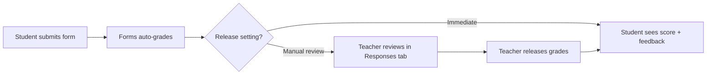

# Google Forms as Quizzes

Google Forms is not just a survey tool. In quiz mode, it becomes an auto-grading assessment platform that every teacher already has access to.

## Enabling Quiz Mode

1. Create a new Google Form
2. Click the **Settings** gear icon
3. Under **Quizzes**, toggle **"Make this a quiz"**
4. Configure:
   - Release grades: **Immediately after submission** or **Later, after manual review**
   - Respondent can see: **Missed questions**, **Correct answers**, **Point values**

Once quiz mode is on, every question gets an **Answer key** button where you set the correct answer and point value.

## Question Design Principles

Good quiz questions test understanding, not recall. Some guidelines:

**Do:**
- Write clear, unambiguous stems
- Make all options plausible
- Test application, not just definitions
- Use "All of the above" sparingly
- Vary difficulty levels

**Do not:**
- Use "trick" questions
- Make the correct answer obviously longer than distractors
- Use double negatives
- Include "None of the above" as a lazy option

### Example: Good vs Bad

**Bad:** What is DNS?
- A. Domain Name System
- B. A type of server
- C. An internet protocol
- D. A website builder

(Tests recall only. Options B and C are vaguely true.)

**Good:** A teacher buys `mrcurriculum.com` and wants it to point to their Vercel-hosted site. What DNS record type should they create?
- A. A record
- B. MX record
- C. TXT record
- D. SPF record

(Tests application. All options are real DNS record types.)

## Auto-Grading Setup

For each question:

1. Click **Answer key** at the bottom of the question
2. Select the correct answer(s)
3. Set the **point value**
4. Optionally add **answer feedback** for correct and incorrect responses

Answer feedback is powerful. Instead of just "Wrong," you can write: "An MX record is for email routing, not website hosting. Review the DNS lesson for record types."

<TeacherNote>
The combination of Google Forms quiz mode and a well-structured question bank in Google Sheets is one of the most efficient assessment workflows available. The next lab (Apps Script Quiz Generator) automates the quiz creation entirely.
</TeacherNote>

## Response Analysis

After students complete the quiz, the **Responses** tab shows:

- **Summary** — Distribution of scores, average, frequently missed questions
- **Question** — Response breakdown per question (which options were chosen)
- **Individual** — Each student's responses and score

The "Frequently missed questions" view is the most useful for instruction. If 60% of students miss a question, that is a teaching signal, not a student failure.

<RealityCheck>
Google Forms quizzes are excellent for formative assessment and practice. They are less suitable for high-stakes summative assessment because students can easily share answers, open other tabs, or retake the quiz. Use them for what they are good at: low-friction, frequent practice with immediate feedback.
</RealityCheck>

<BuildTask>
Create a Google Form quiz:

1. Enable quiz mode
2. Write 5 multiple-choice questions about a topic you teach
3. Set correct answers, point values, and answer feedback for each
4. Take the quiz yourself to verify auto-grading works
5. Review the Responses tab and identify which views are most useful

Estimated time: 25 minutes
</BuildTask>
