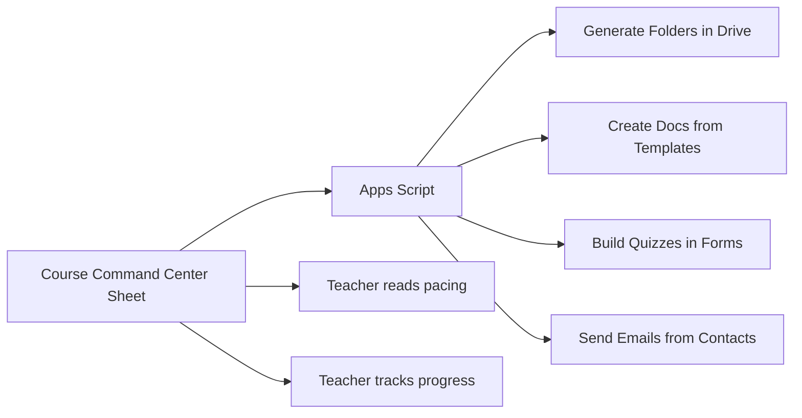

# Google Sheets as a Curriculum Database

Google Sheets is the most underrated tool in a teacher's stack.

Most teachers use it for grades. Maybe a budget tracker. But Sheets can function as a lightweight database — a structured source of truth that drives your entire curriculum system.

## Spreadsheet vs. Database Thinking

| Spreadsheet thinking | Database thinking |
|---------------------|-------------------|
| One sheet for everything | Separate tabs for different data types |
| Free-form text | Consistent column structures |
| Manual formatting | Data validation and dropdowns |
| Visual layout matters | Data structure matters |
| Human reads the sheet | Scripts read the sheet |

The shift is subtle but powerful. When you design a sheet for a script to read — not just for human eyes — it becomes infrastructure.

## The Course Command Center

A command center spreadsheet is a single Google Sheet with multiple tabs that manages your entire course:

```
📊 Course Command Center
├── 📋 Units (unit names, dates, standards, status)
├── 📋 Lessons (lesson titles, types, durations, links)
├── 📋 Assessments (quiz names, types, dates, weights)
├── 📋 Resources (titles, URLs, licenses, tags)
├── 📋 Question Bank (questions, answers, difficulty, tags)
├── 📋 Contacts (student/parent names, emails, groups)
└── 📋 Pacing (week numbers, dates, topics, notes)
```



The command center serves two audiences: you (the human) and your scripts (the automation layer).

## Designing a Good Data Tab

Every data tab should follow these rules:

1. **Row 1 is headers.** Always. No merged cells. No decorative rows above the data.
2. **One row = one record.** Each row is a lesson, a resource, a question — one thing.
3. **Consistent data types.** A column should contain only one type: text, number, date, or URL.
4. **Use data validation.** Dropdowns for status fields, difficulty levels, content types.
5. **No blank rows in the middle.** Scripts break on gaps.

### Example: Lessons Tab

| Unit | Lesson | Type | Duration | Level | Status | Link |
|------|--------|------|----------|-------|--------|------|
| Foundations | What Open TeachStack Is | Lecture | 30 min | Beginner | Complete | [link] |
| Foundations | The Teacher as Builder | Lecture | 25 min | Beginner | Complete | [link] |
| Digital Home | What Is a Domain? | Lecture | 45 min | Beginner | Draft | [link] |
| Digital Home | DNS Explained | Lecture | 40 min | Beginner | Draft | [link] |

### Example: Question Bank Tab

| Topic | Question | Type | Option A | Option B | Option C | Option D | Correct | Difficulty |
|-------|----------|------|----------|----------|----------|----------|---------|------------|
| DNS | What does DNS stand for? | MC | Domain Name System | Digital Network Service | Data Name Server | Domain Net Service | A | Easy |

<RealityCheck>
You do not need to build a complete command center before starting the course. Begin with one tab — the Lessons tab. Add tabs as you need them. The command center grows with your system.
</RealityCheck>

## Named Ranges and Structure

For Apps Script to read your data reliably, use named ranges:

1. Select your data range (including headers)
2. Click **Data** → **Named ranges**
3. Give it a clear name: `LessonsData`, `QuestionBankData`

Named ranges mean your scripts reference `LessonsData` instead of `Sheet1!A1:G50`. When you add rows, update the named range — the script does not change.

<TeacherNote>
The command center pattern is the single most impactful thing in this course. It turns Google Sheets from a passive spreadsheet into an active control panel. Every Apps Script lab in Module 05 reads from a command center sheet.
</TeacherNote>

<BuildTask>
Create a new Google Sheet called "Course Command Center."

1. Create a "Lessons" tab with columns: Unit, Lesson, Type, Duration, Level, Status, Link
2. Add 5 rows of data from a course you teach
3. Add data validation for the Status column: Draft, In Progress, Complete
4. Add data validation for the Type column: Lecture, Lab, Assessment, Activity

Estimated time: 20 minutes
</BuildTask>
