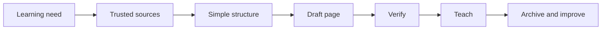

# One-Day Lesson Site Workflow

Sometimes tomorrow's lesson has to exist before tomorrow morning.

That does not mean you need a course platform. It means you need one clear,
source-backed page students can use during class: explanation, vocabulary,
visuals, video, task, exit ticket, and source notes in one place.

This is the Teaching Teachers survival loop:

## Start With the Learning Need

Before opening ChatGPT, Claude, Google AI Studio, Codex, VS Code, Canva, or
anything else, write the real classroom need in plain language:

- What do students need to understand today?
- What standard, skill, or course outcome does it connect to?
- What is the one thing students should leave able to do?
- What evidence will show they got it?

If you cannot answer those questions, the page will become decoration instead
of instruction.

<TeacherNote>
The tool is not the workflow. The workflow starts when the teacher names the
learning need clearly enough that the tool has something useful to support.
</TeacherNote>

## Gather Sources Before Drafting

A fast lesson can still be source-based. Start with the strongest references
available:

- official documentation
- state standards
- district-approved materials
- university or professional organization resources
- open educational resources
- product or manufacturer documentation when teaching tools, software, or hardware
- diagrams, videos, and images that directly clarify the concept

Use the [Teaching Teachers Source Bank](/library/source-bank) when the lesson
uses software, coding platforms, AI tools, open resources, Google Workspace,
cybersecurity resources, or web-development references.

AI can summarize, compare, and structure sources after you have them. AI is not
the source.

## Extract the Teachable Structure

Do not turn sources into a wall of text. Pull out what students need for one
class period:

- hook
- learning target
- key vocabulary
- short explanation
- visual or diagram
- examples and non-examples
- student task
- check for understanding
- exit ticket
- source notes

This is where teacher judgment matters. The goal is not to include everything.
The goal is to build the smallest clear path through the idea.

## Build the Page

A one-day lesson site can be plain HTML and CSS. It can also be a Google Doc,
Google Slide, or simple course page. The format matters less than the structure:
students should have one place to look.

Use the [One-Day Lesson Site Planner](/templates/one-day-lesson-site-planner)
to plan the page before building it.

The page should include:

- lesson title and short hook
- what students will learn
- key vocabulary
- short teacher-friendly explanation
- visual explanation or diagram
- video or media section, if it truly helps
- examples and non-examples
- student task
- check for understanding
- exit ticket
- source notes and attribution

## Verify Before Class

Before students see the page, check:

| Check | Question |
| --- | --- |
| Sources | Are the links official, trusted, or clearly marked for review? |
| Privacy | Did I avoid student names, grades, screenshots, private docs, and account data? |
| Accuracy | Did I check vocabulary, diagrams, examples, and answer keys? |
| Copyright | Are images, videos, and text allowed and attributed? |
| Accessibility | Are headings clear, links descriptive, contrast readable, and images explained? |
| Standards | Does the task still connect to the learning target? |
| Placeholders | Are missing videos, images, or uncertain claims clearly marked? |

<RealityCheck>
A fast lesson still needs review. "I made it quickly" is not a reason to skip
privacy, source, accessibility, or accuracy checks.
</RealityCheck>

## Teach, Archive, Improve

After class, do not throw the page away. Save it with your mini-unit artifacts
and write a short revision note:

- What worked?
- Where did students get confused?
- Which source, image, or video needs replacement?
- Which direction needs clearer wording?
- What should change before teaching it again?

That is how tomorrow's pressure becomes next year's system.

## Example: What Is a Robot?

For an Intro Robotics lesson, a one-day lesson site might include:

- hook: "Is an automatic door a robot?"
- vocabulary: robot, sensor, input, output, controller, actuator
- diagram: Sense -> Think -> Act
- examples: robot vacuum, line-following robot, industrial arm
- non-examples: toaster, automatic door, remote-control car
- task: classify eight systems and defend two choices
- exit ticket: explain one sense-think-act chain
- sources: robot kit documentation, standards link, verified video or image notes

The point is not the website. The point is the clear learning path.

<BuildTask>
Use the One-Day Lesson Site Planner to plan one lesson page for your mini-unit.
Include the learning need, trusted sources, page structure, student task, exit
ticket, source notes, and verification checks.

Estimated time: 45 minutes
</BuildTask>

