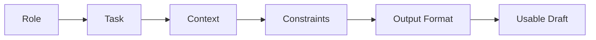

# Prompting for Teachers

You already know how to give instructions. You do it every day — to students, to substitutes, to parent volunteers. You specify what you want, how you want it, and what the constraints are.

Prompt engineering is the same skill, aimed at a different audience: an AI model.

The difference is that AI does not ask clarifying questions. It does not raise its hand. It takes whatever you give it and runs with it. If your instructions are vague, the output will be vague. If your instructions are specific, the output will be specific.

This is not a magic skill. It is a communication skill.

## Why Prompting Matters

Most teachers try AI for the first time by typing something like:

```
Make me a lesson plan about fractions.
```

The result is generic, lifeless, and unusable. It reads like a textbook table of contents wrapped in inspirational language. The teacher concludes that AI is not useful and goes back to doing everything manually.

The problem was not the AI. The problem was the prompt.

A well-structured prompt produces output that is 80% usable on the first try. A vague prompt produces output that is 80% garbage.

<RealityCheck>
Prompting will not make AI perfect. Even the best prompt can produce errors, hallucinations, and generic phrasing. The goal is to get a better starting point — not a finished product. You always review. You always edit. You always own the final version.
</RealityCheck>

## The Anatomy of a Good Prompt

Every effective curriculum prompt has five components:

| Component | What It Does | Example |
|-----------|-------------|---------|
| **Role** | Tells the AI who it is | "You are a high school biology teacher with 10 years of experience." |
| **Task** | What you want it to produce | "Write a formative assessment for cellular respiration." |
| **Context** | Who it is for, where it fits | "For 9th graders who have completed a 3-day lab on mitochondria." |
| **Constraints** | Rules and limitations | "Use only Bloom's Taxonomy levels 2-4. No true/false questions." |
| **Output format** | How you want the result structured | "Return as a numbered list with answer key at the end." |



You do not need all five every time. But the more you include, the better the output.

## Concrete Examples

### Example 1: Lesson Plan

```
Role: You are a curriculum writer for a middle school social studies course.

Task: Write a 50-minute lesson plan on the three branches of the 
U.S. government.

Context: This is for 7th graders in a Title I school. Most students 
have limited background knowledge of government. This is the second 
lesson in a civics unit.

Constraints:
- Include 3 measurable learning objectives using Bloom's verbs
- Opening hook must be under 5 minutes
- Include one collaborative activity (10-15 minutes)
- Do not use political examples from current events
- Reading level should be grade 6-7

Output format: Use this structure:
- Learning Objectives (bulleted list)
- Materials Needed
- Opening Hook (with time)
- Direct Instruction (with time)
- Guided Practice (with time)
- Independent Practice (with time)
- Closure / Exit Ticket (with time)
```

### Example 2: Rubric

```
Role: You are an instructional designer who specializes in 
standards-aligned rubrics.

Task: Create a 4-level rubric for a persuasive essay assignment.

Context: High school English II, 10th grade. Students are writing 
a 5-paragraph persuasive essay on a self-selected topic. This is 
a summative assessment for a rhetoric unit.

Constraints:
- 4 performance levels: Exceeds, Meets, Approaching, Beginning
- 5 criteria: Thesis, Evidence, Organization, Counterargument, Conventions
- Each cell must describe observable, specific behaviors (not "good" 
  or "needs improvement")
- Align to your state's ELA writing standards where applicable

Output format: Formatted as a markdown table with criteria as rows 
and performance levels as columns.
```

### Example 3: Quiz Questions

```
Role: You are a test item writer for a high school computer science 
course.

Task: Write 8 multiple-choice questions about how DNS works.

Context: Students have completed a lesson on domains, IP addresses, 
and DNS resolution. They understand the analogy of DNS as a phone 
book for the internet. No prior networking experience.

Constraints:
- 4 answer choices per question (A, B, C, D)
- 2 questions at recall level (Bloom's 1)
- 4 questions at understanding level (Bloom's 2)
- 2 questions at application level (Bloom's 3)
- No trick questions or "all of the above"
- Distractors should represent common misconceptions, not random 
  wrong answers

Output format: Numbered list. After all questions, include an 
answer key with brief explanations for each correct answer.
```

## Quick lesson generation workflow

Sometimes you do not need a polished unit. You need a clear lesson hub for
tomorrow.

The **One-Day Lesson Site Workflow** is a practical Open TeachStack move: gather
trusted sources, extract the teachable structure, and use Codex, VS Code, Google
AI Studio, ChatGPT, Claude, or another assistant to build a simple HTML/CSS page
with the explanation, media, student task, exit ticket, and source notes in one
place.

This is a survival workflow, not a shortcut around professional judgment.

### The one-day sequence

1. **Start with the learning need.** Name the topic, grade/course, time
   available, target skill, and one thing students should leave able to do.
2. **Gather trusted sources.** Use official documentation, state standards,
   university resources, OER, reputable articles, videos, diagrams, and
   manufacturer documentation when teaching tools or software.
3. **Extract the teachable structure.** Pull out the key idea, vocabulary,
   examples, non-examples, diagram need, student task, check for understanding,
   and exit ticket.
4. **Build a simple page.** Plain HTML and CSS is enough. Make it readable on a
   projector and student devices.
5. **Embed media carefully.** Use videos and images only when they directly
   clarify the lesson. Add source notes and attribution where needed.
6. **Review before teaching.** Do not invent sources, fake citations, claim
   standards alignment without evidence, or include private student information.
7. **Improve after class.** Note what worked, where students got stuck, what
   sources were weak, and what should be archived into the larger unit.

<TeacherNote>
For software lessons, official documentation is the source of truth. Google AI
Studio is useful for trying Gemini prompts and settings, but source-based lesson
pages still need real links to the docs, standards, videos, and resources the
teacher verified.
</TeacherNote>

The full field note is available at [How I Built One-Day Lesson Sites](/field-notes/how-i-built-one-day-lesson-sites).
The reusable prompt is in the [Prompt Library](/prompts#one-day-lesson-site), and
the planning worksheet is in the [Template Library](/templates/one-day-lesson-site-planner).
Use the [Resource Library](/resources) to start from official documentation when
the lesson involves software, AI tools, publishing, licensing, or automation.

## How to Verify AI Output

AI will get things wrong. It generates plausible text, not verified text. Your review process matters more than your prompt.

**Check for these problems:**

1. **Factual errors** — AI can state incorrect dates, misattribute quotes, or describe processes inaccurately. Verify claims against authoritative sources.
2. **Misaligned standards** — AI can reference a standard code that does not match the content it generated. Always check the actual standard text.
3. **Inappropriate difficulty** — AI may write content above or below the target grade level. Read it as your students would.
4. **Generic filler** — Phrases like "In this lesson, students will explore the fascinating world of..." are filler. Delete them.
5. **Missing context** — AI does not know your students. It cannot account for cultural context, prior knowledge gaps, or classroom dynamics.

<TeacherNote>
Build a habit: every time AI generates curriculum content, read it once as a teacher (Is this accurate?) and once as a student (Would I understand this? Would I be bored?). Two passes, two lenses.
</TeacherNote>

## Preserving Your Voice

AI-generated content has a voice. It is smooth, generic, and slightly enthusiastic. It sounds like every other AI-generated lesson plan.

Your students can tell. Your colleagues can tell. You can tell.

To preserve your voice:

- **Feed it examples first.** Paste a lesson you have written and say: "Match this tone and style."
- **Specify tone explicitly.** "Write in a direct, no-nonsense tone. No inspirational openers. No rhetorical questions."
- **Edit the output.** The draft is raw material. Rewrite sentences that do not sound like you.
- **Remove AI-isms.** Delete phrases like "Let's dive in," "In today's fast-paced world," "This powerful tool," and "By the end of this lesson, you will have a deeper understanding of..."
- **Add your examples.** Replace generic examples with ones from your classroom, your community, your subject.

The goal is not to hide that you used AI. The goal is to make sure the final product reflects your expertise and your relationship with your students.

## Common Prompting Mistakes

| Mistake | Why It Fails | Fix |
|---------|-------------|-----|
| Too vague | "Make a lesson plan" produces generic output | Add role, context, constraints, and format |
| Too long | Overloading a single prompt confuses the model | Break complex tasks into multiple prompts |
| No constraints | AI defaults to lowest-common-denominator content | Specify grade level, Bloom's level, length, tone |
| No format | Output comes as a wall of text | Request tables, bullet lists, or specific templates |
| Trusting output | Assuming AI output is correct | Always verify facts, standards, and difficulty level |
| Copying AI voice | Publishing output without editing for your tone | Rewrite in your voice, add your examples |

## The Iterative Approach

Prompting is rarely one-and-done. Treat it as a conversation:

1. **First prompt** — Get a draft
2. **Review** — Identify what works and what does not
3. **Follow-up prompt** — "Revise questions 3 and 7 to target application level instead of recall" or "Rewrite the opening hook to use an analogy about school lunch lines"
4. **Review again** — Check the revisions
5. **Edit manually** — Make final adjustments yourself

Each round gets you closer. The AI handles the bulk generation; you handle the judgment, accuracy, and voice.

<ReflectionPrompt>
Think about the last time you wrote a lesson plan from scratch. How long did it take? Now think about how long it would take if you had a solid first draft in 30 seconds that you only needed to verify and adjust. What would you do with the time you saved?
</ReflectionPrompt>

## What Prompting Cannot Do

Be honest about the limits:

- Prompting cannot replace subject matter expertise. If you do not know the content well enough to verify the output, you should not be using AI to generate it.
- Prompting cannot replace pedagogical judgment. AI does not know which activities work in your classroom.
- Prompting cannot replace relationship. Your students respond to your voice, your examples, your humor. AI cannot replicate that.
- Prompting cannot guarantee accuracy. Every output needs verification.

## Recommended Resources to Curate

- Official documentation for the AI tool you use (Claude, ChatGPT, Gemini) — each has prompt engineering guides
- Your state education department's guidance on AI use in schools
- Your district's acceptable use policy for AI tools
- Bloom's Taxonomy verb lists for writing learning objectives
- Published prompt libraries from education organizations (ISTE, edutopia)

<BuildTask>
Write three prompts for content you actually need this semester:

1. A lesson plan prompt (include all five components: role, task, context, constraints, format)
2. A rubric or assessment prompt
3. A quiz or discussion question prompt

Run each prompt in an AI tool. Then:
- Identify at least one factual error or misalignment in each output
- Rewrite two sentences in each output to match your teaching voice
- Save the prompts in a "Prompt Library" document for reuse

Estimated time: 35 minutes
</BuildTask>
