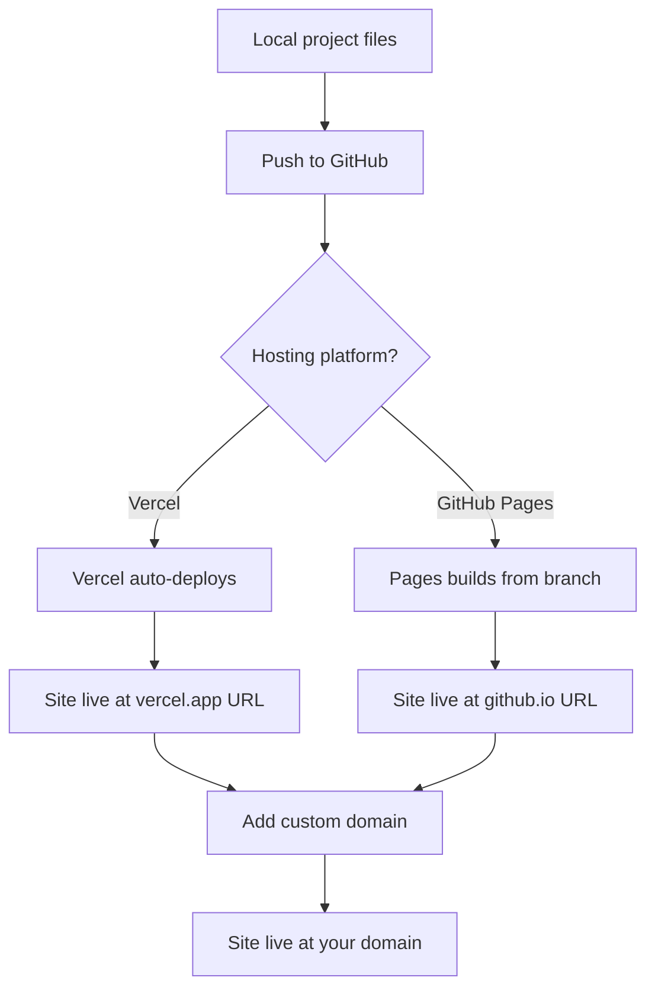

# Publishing Your Curriculum Hub

Your curriculum has lived in Google Drive, in a command center spreadsheet, and in your head. Now it is time to publish it — to give it a public address where students, colleagues, and the world can access it.

Publishing is not just sharing a link. It is creating a permanent, professional home for your work.

## Hosting Options

| Platform | Cost | Best For | Limitations |
|----------|------|----------|-------------|
| Vercel | Free | Next.js sites, fast deploys | Framework-specific |
| GitHub Pages | Free | Static HTML/CSS, Jekyll, simple sites | No server-side logic |
| Netlify | Free tier | Static sites, form handling | Build minutes limited |
| Google Sites | Free | Quick, no-code pages | Limited customization |
| Cloudflare Pages | Free | Static sites, global CDN | Less beginner-friendly |

For this course, we use **Vercel** (for Next.js projects) or **GitHub Pages** (for simpler static sites).

## Deploying to Vercel

If your curriculum hub is built with Next.js (like this site):

1. Push your project to a GitHub repository
2. Go to [vercel.com](https://vercel.com) and sign in with GitHub
3. Click **"Add New Project"**
4. Select your repository
5. Click **"Deploy"**

Vercel detects Next.js automatically, builds the site, and gives you a URL like `my-curriculum.vercel.app`.

Every time you push changes to GitHub, Vercel rebuilds and redeploys automatically.

## Deploying to GitHub Pages

If your curriculum hub is simpler static HTML:

1. In your repository, go to **Settings → Pages**
2. Under **Source**, select the branch and folder (usually `main` and `/docs` or `/`)
3. Click **Save**
4. Your site appears at `yourusername.github.io/repository-name`

## Connecting Your Domain

Once deployed, connect your custom domain:

### On Vercel:
1. Go to your project's **Settings → Domains**
2. Add your domain (e.g., `mrcurriculum.com`)
3. Vercel shows the DNS records you need
4. Add those records at your registrar
5. Wait for propagation (usually minutes, sometimes hours)
6. HTTPS is enabled automatically

### On GitHub Pages:
1. Go to **Settings → Pages → Custom domain**
2. Enter your domain
3. Add a CNAME file to your repository with your domain
4. Add DNS records at your registrar
5. Enable **"Enforce HTTPS"**

<RealityCheck>
Your first deploy will not be perfect. There will be broken links, missing styles, or content that looks different than expected. That is normal. Deploy early, fix iteratively. A live site with rough edges is more useful than a perfect site on your laptop.
</RealityCheck>

## Post-Publish Checklist

After your site is live:

- [ ] All pages load without errors
- [ ] Links work (internal and external)
- [ ] Images display correctly
- [ ] Mobile layout is readable
- [ ] HTTPS is enabled (padlock icon in browser)
- [ ] Custom domain resolves correctly
- [ ] Google can find your site (submit URL to Google Search Console)

## Maintenance

A published site needs maintenance:

- **Update content** as you teach and refine lessons
- **Check links** periodically for dead URLs
- **Update dependencies** (for Next.js sites, run `npm update` monthly)
- **Back up your content** — your GitHub repo is the backup, as long as you commit regularly

<TeacherNote>
Publishing is the most tangible outcome of this course. When a teacher sees their curriculum at their own domain for the first time, the abstract concepts (DNS, hosting, version control) become concrete. Make sure every student reaches this milestone, even if their site only has one page.
</TeacherNote>

<BuildTask>
Deploy your mini-course or curriculum page:

1. Choose Vercel or GitHub Pages
2. Push your project to GitHub
3. Connect the hosting platform
4. Verify the site loads
5. (Optional) Connect your custom domain

Estimated time: 30 minutes
</BuildTask>
