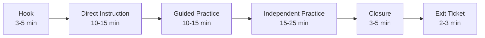

# Video Delivery and Presentation

A great lesson plan means nothing if the delivery fails. And delivery fails more often than teachers admit — not because of bad teaching, but because of bad communication design.

Slides that are walls of text. Screen recordings with no structure. Instructions that assume students read the same way teachers do. Exit tickets that no one reviews.

This lesson is about treating delivery as a design problem, not an afterthought.

## Slides as Lesson Structure

Slides are not decoration. They are not a teleprompter for the teacher. They are the structural backbone of a lesson — a visual roadmap that guides students through the learning experience.

**What slides should do:**

- Signal transitions between lesson phases
- Display key terms, diagrams, and examples students need to reference
- Provide a visual anchor so students know where they are in the lesson
- Reduce cognitive load by presenting information in small, organized chunks

**What slides should not do:**

- Contain every word the teacher plans to say
- Replace the teacher's explanation with walls of text
- Distract with animations, transitions, and clip art
- Display content students will never reference again

### Slide Design Principles

| Principle | Bad | Good |
|-----------|-----|------|
| Text volume | Full paragraphs on every slide | 3-5 bullet points or a single key statement |
| Font size | 14pt body text | 24pt minimum for readability |
| Images | Decorative clip art | Diagrams that illustrate the concept |
| Transitions | Swooping animations | Simple cut or fade |
| Structure | Random slide order | Matches lesson flow: hook, instruction, practice, closure |

### The Slide-as-Signpost Approach

Number your slides or label them by lesson phase:

```
Slide 1:  Title — Topic, Date, Learning Objective
Slide 2:  Hook — Opening question or scenario
Slide 3:  Key Concept — Definition and diagram
Slide 4:  Example — Worked example with annotation
Slide 5:  Your Turn — Guided practice instructions
Slide 6:  Independent Practice — Task instructions and success criteria
Slide 7:  Closure — Exit ticket question
```

Students should be able to glance at the slide and know what phase of the lesson they are in. If your slide deck does not provide that orientation, it is not doing its job.

<TeacherNote>
Create a slide template in Google Slides with pre-formatted layouts for each lesson phase. Title slide, instruction slide, activity slide, closure slide — each with consistent fonts, colors, and spacing. Copy this template for every lesson. Consistency across lessons reduces student confusion and saves you design time.
</TeacherNote>

## Screen Recording Basics

Screen recordings let you deliver content asynchronously — for flipped classrooms, absent students, review materials, or self-paced courses. You do not need a studio. You need a plan and a free tool.

### Tools

| Tool | Cost | Best For |
|------|------|----------|
| **OBS Studio** | Free, open source | Full control, local recording, no time limits |
| **Loom** | Free tier (limited) | Quick recordings with webcam overlay, easy sharing |
| **Google Slides + narration** | Free | Adding audio to existing slide decks |
| **Screencastify** | Free tier (limited) | Chrome-based recording, integrates with Google |

For most teachers, OBS Studio is the best long-term choice. It is free, has no time limits, and records locally (no upload required). The learning curve is steeper than Loom, but the flexibility is worth it.

### Recording Tips

1. **Script or outline first.** Do not press record and improvise. Write at least a bullet-point outline of what you will say on each slide.
2. **Keep recordings short.** 5-10 minutes per video. Students will not watch a 45-minute recording. Break long lessons into segments.
3. **Show your face occasionally.** A webcam overlay in the corner helps students feel connected. You do not need it on every frame — toggle it on for introductions and key moments.
4. **Clean your screen.** Close notifications, browser tabs, and anything you do not want recorded. Use a clean desktop.
5. **Use a decent microphone.** Audio quality matters more than video quality. A $20 USB microphone is dramatically better than a laptop microphone. Earbuds with a built-in mic work in a pinch.
6. **Record in a quiet space.** Background noise is distracting. If your environment is noisy, record early in the morning or use a closet (seriously — soft surfaces absorb echo).

<RealityCheck>
Your recordings do not need to be polished. Students do not expect broadcast quality. They expect clarity, audibility, and a teacher who gets to the point. A slightly imperfect recording that exists is infinitely more useful than a perfect recording you never make.
</RealityCheck>

## Pacing a Lesson

Pacing is about rhythm. A lesson that is all lecture puts students to sleep. A lesson that is all activity leaves students without the knowledge to succeed. Good pacing alternates between modes.



### Three Delivery Modes

**Lecture mode** — Teacher talks, students listen. Use for introducing concepts, demonstrating procedures, modeling thinking. Keep it under 15 minutes. Break it up with questions.

**Lab mode** — Students work on a structured task with clear steps. The teacher circulates and troubleshoots. Use for technical skills, hands-on practice, or guided exercises. Provide written instructions students can reference.

**Workshop mode** — Students work on open-ended projects with teacher support. Less structured than lab mode. Use for creative work, long-term projects, or application tasks. Provide a rubric or success criteria so students know what "done" looks like.

### Pacing Mistakes

| Mistake | Consequence | Fix |
|---------|-------------|-----|
| Lecture for 30+ minutes | Students disengage by minute 15 | Break instruction into 10-minute segments with activities between |
| No transition signals | Students do not know the lesson phase changed | Use slides as signposts, verbally announce transitions |
| Rushing closure | No time for exit ticket or reflection | Set a timer for 5 minutes before the end of class |
| All activity, no instruction | Students lack the knowledge to succeed at the task | Front-load key concepts before practice |
| Same mode every day | Students stop paying attention out of boredom | Vary the balance of lecture, lab, and workshop across the week |

## Student-Facing Instructions

The number one reason students ask "what are we supposed to do?" is not that they were not listening. It is that the instructions were unclear.

Student-facing instructions are different from teacher-facing lesson plans. They must be:

- **Concrete** — "Open the Google Doc linked below" not "Access the resource"
- **Sequential** — Numbered steps in order of completion
- **Visual** — Include screenshots when referencing digital tools
- **Limited** — No more than 5-7 steps visible at once
- **Accessible** — Written at or below grade level; no jargon students have not been taught

**Example: Bad Instructions**

```
Complete the DNS activity. Use the resources provided to research 
how DNS works and create a presentation demonstrating your 
understanding of the resolution process.
```

**Example: Good Instructions**

```
DNS Lookup Activity

1. Open the assignment link in Google Classroom.
2. Make a copy of the Google Doc (File → Make a copy).
3. Read the short article on DNS (linked on page 1 of the doc).
4. Answer Questions 1-4 in your own words. Use complete sentences.
5. For Question 5, draw or describe the 4 steps of DNS resolution.
6. When finished, click "Turn In" in Google Classroom.

Due: End of class today.
Ask for help if you are stuck on any step.
```

The second version is longer but clearer. Students can follow it without asking a single question.

<ReflectionPrompt>
Think about the last time many students asked you to re-explain an assignment. Were the instructions written down? Were they specific? Were they written for students, or for you? What would you change?
</ReflectionPrompt>

## Exit Tickets and Feedback Loops

An exit ticket is a short formative assessment at the end of a lesson. It takes 2-3 minutes and gives you data you can use tomorrow.

**Exit ticket formats:**

- One question: "What is the purpose of a DNS resolver?"
- Two prompts: "Write one thing you learned. Write one thing you are still confused about."
- Quick check: A single multiple-choice question on a Google Form

**The feedback loop:**

1. Students complete the exit ticket in the last 3 minutes of class.
2. You review responses that evening or before the next class.
3. You adjust the next lesson based on what you learned.
4. You address common misconceptions at the start of the next class.

This is the simplest, most effective feedback loop in teaching. It costs almost nothing in class time and fundamentally changes how you plan.

### Making It Sustainable

- Use a Google Form with one question. Duplicate the form for each lesson and change the question. This takes 30 seconds.
- Review responses by scanning, not analyzing. You are looking for patterns: "Most students got this, but half are confused about that."
- Do not grade exit tickets. The moment you grade them, students stop being honest about confusion.

<TeacherNote>
Create a single Google Form template for exit tickets. Two fields: "What did you learn today?" (short answer) and "What are you still confused about?" (short answer). Duplicate it for each lesson. The data accumulates over the semester and becomes a powerful record of student progress and your own instructional effectiveness.
</TeacherNote>

## Putting It Together

A well-delivered lesson combines all of these elements:

1. **Slides** structure the lesson and signal transitions
2. **Pacing** balances instruction, practice, and reflection
3. **Instructions** are written for students, not for you
4. **Exit tickets** close the loop and inform tomorrow's plan
5. **Recordings** (when needed) extend the lesson beyond the classroom

None of these require expensive tools. Google Slides, a free screen recorder, a Google Form, and clear writing. The investment is in design thinking, not technology.

## Recommended Resources to Curate

- OBS Studio official documentation and beginner tutorials
- Google Slides template galleries for educational presentations
- Your district's guidelines on recording students and sharing video content
- Loom's free tier documentation for quick screen recordings
- Research on multimedia learning principles (Mayer's principles) for evidence-based slide design
- Your school's student data privacy policy for any tools that involve student responses

<BuildTask>
Design the delivery plan for one lesson you teach this semester:

1. Create a slide deck with 6-8 slides following the signpost approach (hook, instruction, practice, closure)
2. Write student-facing instructions for the main activity — test them by having a colleague read them without additional explanation
3. Create a one-question exit ticket as a Google Form
4. Record a 3-5 minute screen recording of yourself presenting the first two slides (use OBS, Loom, or any free tool)

Review: Are the slides readable from the back of the room? Are the instructions clear without your verbal explanation? Does the exit ticket measure the learning objective?

Estimated time: 45 minutes
</BuildTask>
