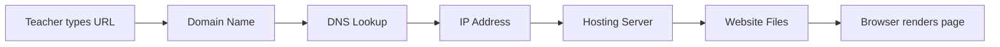

# What Is a Domain?

A domain is not the website itself. It is the address people use to reach the website.

When someone types `openteachstack.dev` into a browser, the domain is the human-readable part. Behind the scenes, a system called DNS translates that name into a numeric IP address that points to a server where the actual website files live.

## The Full Chain

Each piece of this chain is separate:

| Component | What it is | Example |
|-----------|-----------|---------|
| Domain | The human-readable address | `mrcurriculum.com` |
| DNS | The system that translates domains to IPs | Managed by your registrar |
| Hosting | The server where files live | Vercel, GitHub Pages, Netlify |
| Website | The actual HTML, CSS, and content | Your curriculum site |

You can buy a domain from one company, point the DNS to another, and host your files somewhere else entirely. They are independent layers.

## Why Teachers Need a Domain

A domain is your digital home address. Without one, your curriculum lives at someone else's address:

- `docs.google.com/document/d/1xK3m...` — Nobody will remember this.
- `mrcurriculum.notion.site` — Notion owns the address. If they change, you change.
- `sites.google.com/view/mrcurriculum` — Google controls the namespace.

With your own domain:

- `mrcurriculum.com` — You own this. You control where it points.
- `curriculum.mrcurriculum.com` — You can create subdomains for different projects.
- `mrcurriculum.com/robotics` — Clean, professional, permanent URLs.

<RealityCheck>
A domain costs roughly $10–15 per year. That is less than one month of most ed-tech subscriptions. It is one of the cheapest and most valuable pieces of infrastructure you can own.
</RealityCheck>

## Choosing a Domain Name

Guidelines for teachers:

1. **Keep it professional.** Your name, your subject, or your project. Not a joke.
2. **Keep it short.** Under 20 characters if possible.
3. **Use `.com` or `.dev` or `.org`.** Avoid novelty TLDs like `.ninja` or `.guru`.
4. **Avoid hyphens and numbers.** They are hard to communicate verbally.
5. **Check that it is not taken.** Use your registrar's search tool.

Good examples:
- `nevarez.dev`
- `mschenteacher.com`
- `buildwithcode.org`

Bad examples:
- `mr-johnson-teaches-math-2024.com`
- `coolteacher99.xyz`

<ReflectionPrompt>
What would you want your curriculum site address to communicate about you? Write down three candidate domain names and evaluate each against the guidelines above.
</ReflectionPrompt>

## Where to Buy a Domain

Recommended registrars for teachers:

- **Cloudflare Registrar** — At-cost pricing, no markup, solid DNS.
- **Namecheap** — Affordable, beginner-friendly interface.
- **Google Domains** (now Squarespace) — Familiar if you use Google Workspace.
- **Porkbun** — Low prices, straightforward.

Avoid GoDaddy for new purchases — aggressive upselling and confusing UI.

<TeacherNote>
If your school provides a subdomain (e.g., `johnson.schooldistrict.edu`), you can still use that as a secondary address. But owning your own domain means your curriculum survives job changes, district mergers, and platform migrations.
</TeacherNote>

## What Comes Next

Once you own a domain, you need to:

1. **Point it somewhere** — Configure DNS records to connect it to your hosting.
2. **Set up hosting** — Choose where your website files will live.
3. **Build the site** — Create the actual curriculum content.

We cover DNS in the next lesson.

<BuildTask>
Search for a domain name you would use for your curriculum site. Do not buy it yet — just check availability and price at two different registrars. Compare the results.

Estimated time: 15 minutes
</BuildTask>
