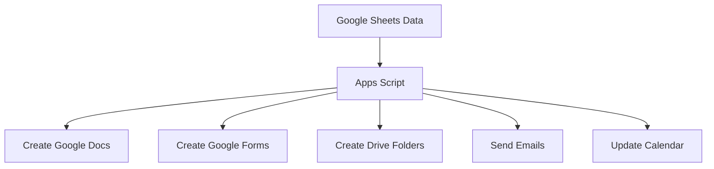

# What Is Google Apps Script?

Google Apps Script is a JavaScript-based scripting platform built into Google Workspace. It lets you automate tasks across Google Sheets, Docs, Forms, Drive, Gmail, and Calendar — without installing anything.

It runs in the cloud. It is free. And it is already available in every Google account.

## Why Teachers Should Care

Apps Script is not a tool for software engineers. It is a tool for anyone who does repetitive work in Google Workspace — which describes every teacher.

Common teacher use cases:

- **Generate folders** for each unit in Google Drive automatically
- **Create documents** from templates using data from a spreadsheet
- **Build quizzes** in Google Forms from a question bank in Sheets
- **Send email reminders** to students or parents on a schedule
- **Add custom menus** to your spreadsheets for one-click workflows



## Where Apps Script Lives

Apps Script is not a separate application. It lives inside your Google Workspace:

1. **Container-bound scripts** — Attached to a specific Sheet, Doc, or Form. Open via Extensions → Apps Script.
2. **Standalone scripts** — Independent projects at `script.google.com`. Not attached to any file.

For most teacher workflows, you will use container-bound scripts attached to Google Sheets.

## Your First Look

To open the Apps Script editor:

1. Open any Google Sheet
2. Click **Extensions** → **Apps Script**
3. The editor opens in a new tab

You will see a file called `Code.gs` with an empty function:

```javascript
function myFunction() {
  
}
```

That is your starting point. In the next lesson, you will write your first real script.

<RealityCheck>
Apps Script uses JavaScript syntax, but you do not need to "learn JavaScript" to use it effectively. Most teacher scripts are 10–50 lines of code that follow clear patterns. This course teaches those patterns, not computer science theory.
</RealityCheck>

## What Apps Script Cannot Do

Be honest about limitations:

- It is **slow** for large datasets (thousands of rows take seconds, not milliseconds)
- It has **daily quotas** (email sends, execution time, etc.)
- It only works with **Google services** (no direct Microsoft Office integration)
- The editor is **basic** compared to professional code editors
- Error messages are **sometimes cryptic**

For teacher-scale workflows — dozens of folders, hundreds of quiz questions, weekly emails — these limitations do not matter.

<TeacherNote>
If a colleague tells you "just use a macro," know that Google Sheets macros are actually Apps Script under the hood. The macro recorder generates Apps Script code. Learning Apps Script directly gives you far more control than the macro recorder.
</TeacherNote>

## The Apps Script Lab Series

The next five lessons are hands-on labs:

1. **Your First Custom Menu** — Add buttons to your spreadsheet
2. **Generate Unit Folders** — Create Drive folder structures from Sheet data
3. **Generate Docs from Rows** — Mail-merge-style document creation
4. **Create Quizzes from a Sheet** — Build Google Forms programmatically
5. **Send Reminder Emails** — Automated email from spreadsheet data

Each lab starts with a working example you can copy and modify.

<BuildTask>
Open any Google Sheet you use for teaching. Click Extensions → Apps Script. Look at the editor. Do not write anything yet — just get familiar with the interface.

Note:
- Where the Run button is
- Where you see execution logs
- How to switch between files

Estimated time: 10 minutes
</BuildTask>
