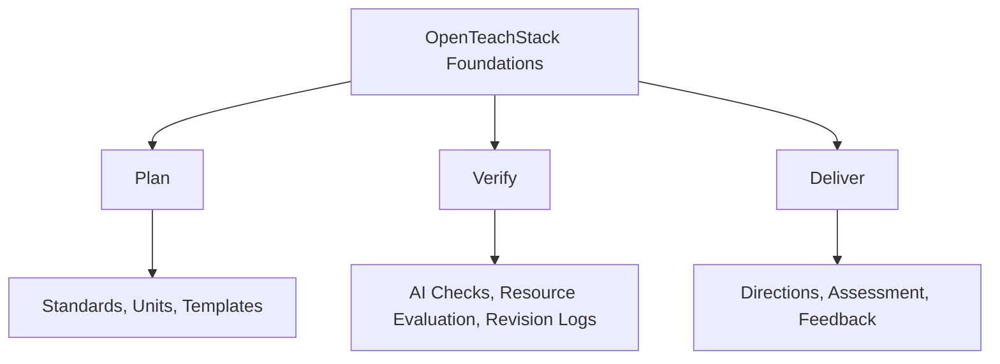

# What OpenTeachStack Is

OpenTeachStack is not a list of apps. It is not a recommendation engine. It is not a startup pitch about "transforming education."

It is a field guide for building your own curriculum systems. The full pathway eventually reaches automation, open publishing, and course sites. OTS-101 starts with the foundations.

## The Problem

Most teachers inherit a disorganized pile of digital tools. A Google Drive folder from three years ago. A bookmark bar full of dead links. A subscription to a platform that changed its pricing. A shared folder someone else organized and no one maintains.

There is no architecture. No system. No documentation. No version control.

When you need to rebuild — because you changed grade levels, schools, or subjects — you start from scratch.

<ReflectionPrompt>
Think about your current digital workspace. Could you rebuild it from scratch in a weekend? Could someone else take over your files and understand the system?
</ReflectionPrompt>

## The Alternative

OpenTeachStack treats your curriculum like a system to be designed, built, documented, and maintained.

Across the full pathway, that means thinking about:

- **File architecture** — How are your Google Drive folders organized?
- **Templates** — What reusable structures save you time?
- **Prompting and verification** — How do you use AI without outsourcing judgment?
- **Standards alignment** — How do you prove the work starts from real learning goals?
- **Resource literacy** — How do you find, cite, and adapt materials responsibly?
- **Delivery planning** — How do students experience the work in class?

## The Three Pillars

- **Plan** — Turn standards and teaching goals into a coherent mini-unit.
- **Verify** — Check AI output, resources, alignment, accessibility, and copyright.
- **Deliver** — Prepare directions, assessment, feedback, and revision routines.

## Who This Course Is For

This course is for teachers who:

- Feel overwhelmed by their digital workspace
- Want to stop depending on platforms that change or disappear
- Are curious about how the infrastructure behind their tools actually works
- Want to build something lasting — not just survive the semester

You do not need to be a programmer. You do not need to know how to code. But by the end of this course, you will know enough to be dangerous in the best way.

<TeacherNote>
This is also useful for instructional coaches, curriculum directors, and ed-tech coordinators who support teachers. The systems thinking here scales beyond a single classroom.
</TeacherNote>

## What You Will Build

By the end of OTS-101, you will have:

- A teacher workflow audit
- A standards unpacking sheet
- A 3 to 5 lesson mini-unit map
- A reusable lesson template
- A prompt library
- A resource evaluation sheet
- An assessment or quiz draft with a rubric
- AI verification and safety checklists
- A delivery plan
- A reflection and revision log

That is OpenTeachStack.

<RealityCheck>
This is not a weekend project. Building a real curriculum system takes time. This course is designed to be worked through over several weeks, one module at a time. Do not rush. Build well.
</RealityCheck>

