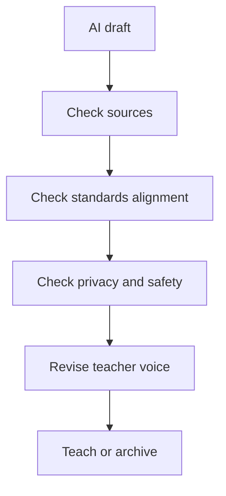

# Verify AI output

## The real problem

AI can sound confident while being wrong, generic, biased, or unsafe for students.

## Quick answer

Verify facts, sources, alignment, privacy, accessibility, and teacher voice before using the output.

## When to use this

Use this after any AI-generated lesson plan, rubric, source summary, quiz, code, or student-facing direction.

## Workflow

## What to verify

If you cannot verify it, do not teach it yet.

## Common mistakes

- Trusting a citation because it looks formal.
- Keeping fake alignment language.
- Sending student data into a tool without checking policy.

## Related course chapters

- OTS-101 Chapter 03: AI Literacy and Verification

## Related prompts/templates/tools

- AI verification checklist
- Source bank
- Safety checklist

## Next action

Take one AI draft and mark every claim that needs a source, policy check, or rewrite.
